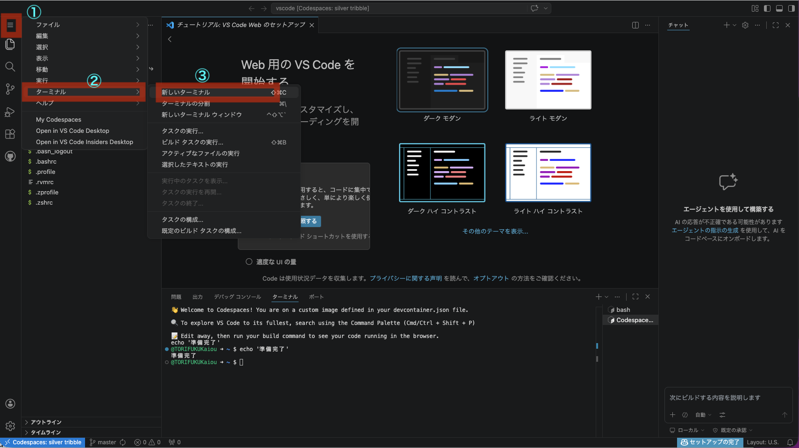

# 第1回：オリエンテーション

## 今日のゴール

プログラミングとは何か、<ruby>Ruby<rt>ルビー</rt></ruby>とは何か、この授業で何を目指すのかを知る。

---

## プログラミングとは何か

プログラミングとは、コンピュータに対して「やってほしいこと」を書くことです。

コンピュータは賢そうに見えますが、実は何も考えていません。人間が書いた命令を、書かれた通りに実行するだけです。

つまりプログラミングとは、「自分がやりたいことを、コンピュータにわかる言葉で、正確に伝える技術」です。

---

## プログラミング言語はたくさんある

世の中にはプログラミング言語がたくさんあります。

- <ruby>Python<rt>パイソン</rt></ruby> — AI、データ分析でよく使われる
- <ruby>JavaScript<rt>ジャバスクリプト</rt></ruby> — Webブラウザで動く
- <ruby>Java<rt>ジャバ</rt></ruby> — 企業の大規模システムで使われる
- <ruby>C<rt>シー</rt></ruby> — OSやハードウェアに近い処理で使われる
- <ruby>Ruby<rt>ルビー</rt></ruby> — Webアプリケーション開発で使われる

どの言語も「コンピュータに命令を伝える」という目的は同じです。違うのは書き方と得意分野です。

---

## なぜRubyなのか

Rubyは日本人のまつもとゆきひろさん（Matz）が作ったプログラミング言語です。

Rubyの特徴：

- **読みやすい** — 英語に近い書き方ができる
- **書きやすい** — 少ないコードで多くのことができる
- **Webアプリが作れる** — <ruby>Ruby on Rails<rt>ルビーオンレイルズ</rt></ruby>というフレームワークがある

この授業では、まずRubyでプログラミングの基礎を学び、後半で<ruby>Ruby on Rails<rt>ルビーオンレイルズ</rt></ruby>を使ってWebアプリケーションを作ります。

---

## 生成AIとプログラミング

ChatGPTやCopilotなど、コードを書いてくれるAIがあります。「AIが書いてくれるなら、自分で書く必要はないのでは？」と思うかもしれません。

答えは「自分で書けないと、AIが書いたものが正しいかどうか判断できない」です。

AIは間違えます。それも、もっともらしく間違えます。正しいかどうかを見抜くには、自分自身にプログラミングの知識が必要です。

この授業では：
- まず自分の手で書けるようになる
- その上で、AIを道具として使えるようになる

順番が大事です。読めない言語で書かれた文章を、翻訳ツールだけで理解しようとするのと同じです。基礎がなければ、道具は使いこなせません。

---

## この授業の進め方

- 前期はRubyの基礎を学びます（変数、配列、条件分岐、繰り返し、メソッド、クラス）
- 後期は<ruby>Ruby on Rails<rt>ルビーオンレイルズ</rt></ruby>を使ってWebアプリケーションを作ります
- 毎回、手を動かします。聞くだけの授業ではありません
- 環境は<ruby>Codespaces<rt>コードスペース</rt></ruby>を使います。自分のPCにインストールする必要はありません

---

## GitHubとは

GitHubは、プログラムのコードを保存・共有するためのサービスです。世界中のプログラマーが使っています。

この授業ではGitHubのアカウントを作って使います。アカウント作成は無料です。

### アカウント作成手順

1. https://github.com にアクセス (リンクを右クリックして、「リンクを新しいタブで開く」)
2. 「<ruby>Sign up<rt>サインアップ</rt></ruby>」をクリック
3. メールアドレス、パスワード、ユーザー名を入力
4. メール認証を完了する

（※ 授業中に一緒にやります。焦らなくて大丈夫です）

---

## <ruby>Codespaces<rt>コードスペース</rt></ruby>とは

<ruby>Codespaces<rt>コードスペース</rt></ruby>は、GitHub上でプログラミングができる環境です。ブラウザだけで動きます。

普通、プログラミングを始めるには自分のPCにいろいろなソフトをインストールする必要があります。<ruby>Codespaces<rt>コードスペース</rt></ruby>を使えば、その手間がゼロになります。

- ブラウザがあれば使える
- 自分のPCに何もインストールしなくていい
- 学校のPCでも自宅のPCでも同じ環境で作業できる

---

## <ruby>Codespaces<rt>コードスペース</rt></ruby>を使ってみよう

1. GitHubにログインする
2. [このリポジトリ](https://github.com/TORIFUKUKaiou/rails-dojo-year1-content/)のページを開く (リンクを右クリックして、「リンクを新しいタブで開く」)
3. 「Code」ボタン → 「Codespaces」タブ → 「Create codespace on main」をクリック

    

4. しばらく待つ（初回は1〜2分かかります）

画面が開いて、「**準備完了**」の文字が表示されたらプログラミングができる環境が整っています。


---

## VS Codeとは

VS Code は、プログラムを書くためのソフトです。正式には Visual Studio Code といいます。

今回使うのは、<ruby>Codespaces<rt>コードスペース</rt></ruby> 上で動いている VS Code です。自分の PC にインストールしなくても、ブラウザの中で使えます。

画面にはいくつかの場所がありますが、まず覚えるのは次の3つで十分です。

- 左側: ファイル一覧を見る場所
- 中央: ファイルを開いて内容を書く場所
- 下側: ターミナルを使う場所

最初は全部を理解する必要はありません。この授業では、まず「ファイルを開く」「コードを書く」「ターミナルで実行する」の3つができれば大丈夫です。

---

## エディタとは

エディタは、文字を書くための道具です。メモ帳も広い意味ではエディタですが、VS Code はプログラミング用に作られたエディタです。

レポートを書くときに Word を使うように、プログラムを書くときはエディタを使います。

今日使う中央の画面は、Ruby のプログラムを書く場所です。ここに `main.rb` の内容を書いていきます。

---

## ターミナルとは

ターミナルは、コンピュータに文字で命令を出す画面です。マウスではなく、キーボードで操作します。

<ruby>Codespaces<rt>コードスペース</rt></ruby>の画面の下半分に「ターミナル」と書かれた黒い画面(※)があります。ここに文字を打って Enter を押すと、コンピュータが命令を実行します。  
(※)テーマ設定によっては、白い画面の場合がありますから、この業界では昔から「黒い画面」と呼ばれています。

もし見当たらなければ、画面上部のメニューから「ターミナル」→「新しいターミナル」を選んでください。



---

## Rubyが動くか確認する

ターミナルに以下を入力して Enter を押してください：

```
ruby -v
```

`ruby 4.0.1` のようにバージョンが表示されたら、Rubyが使える状態です。

---

## エラーが出ても大丈夫

このあと `ruby main.rb` を実行したときに、エラーが出ることがあります。

それは失敗ではありません。プログラミングでは、エラーを読んで、原因を考えて、直して、もう一度試すことを何度も繰り返します。これは特別なことではなく、日常茶飯事です。

大事なのは、エラーが出たら止まるのではなく、次の順番で動くことです。

1. エラー文をよく読む
2. Google検索や生成AIを使って、原因の仮説を立てる
3. その仮説をもとに修正する
4. もう一度実行する

最初から一発で正しく書ける人はいません。エラーを出して修正すること自体が、よい練習になります。

---

## ファイルにRubyのプログラムを書いて実行する

1. 画面左側のファイル一覧で `content` の外側、ホームディレクトリのあたりを右クリック →「新しいファイル」→ `main.rb` と入力

    

2. ファイルに以下を書く：

```ruby
puts "Hello, World!"
```

※ <ruby>Codespaces<rt>コードスペース</rt></ruby> 上の VS Code では、自動保存が初期設定で有効になっています。そのため、この環境では保存操作をしなくても変更は反映されます。ただし、開発環境によっては、保存しないと変更が反映されないこともあります。書き換えたら `ruby main.rb` を実行してください。

3. ターミナルで以下を実行する：

```
ruby main.rb
```

`Hello, World!` と表示されたら成功です。これがあなたの最初のプログラムです。

---

## まとめ

今日やったこと：

1. プログラミングとは何かを知った
2. Rubyという言語を知った
3. GitHubアカウントを作った
4. <ruby>Codespaces<rt>コードスペース</rt></ruby>でプログラミング環境を立ち上げた
5. `ruby main.rb` でプログラムを実行した

次回以降、毎回やること：

1. <ruby>Codespaces<rt>コードスペース</rt></ruby>を起動する
2. ファイルにRubyのプログラムを書く
3. ターミナルで `ruby ファイル名.rb` を実行する

この3ステップが基本です。毎回繰り返すので、自然に覚えます。
