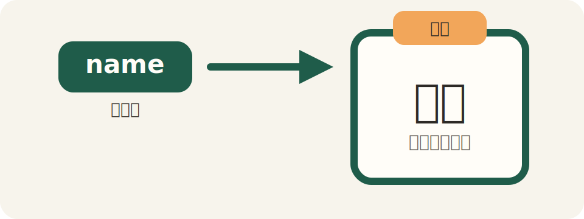
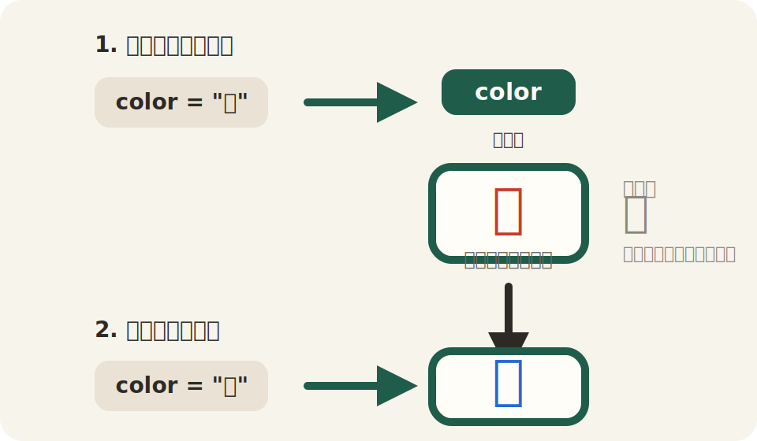
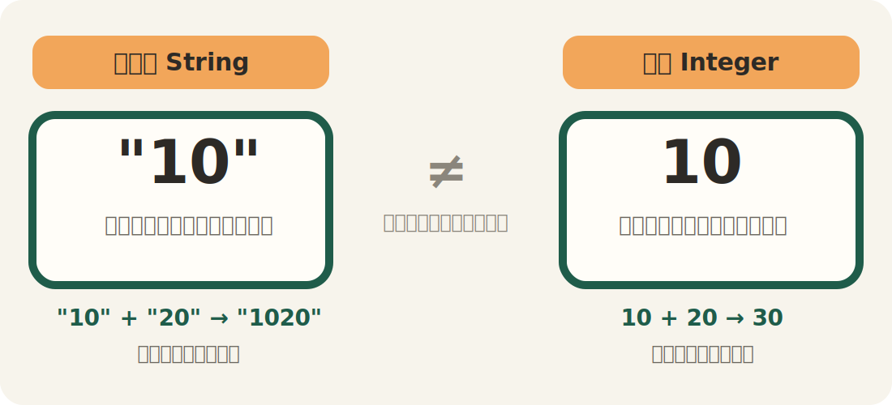

# 第2回：変数 ── データに名前をつける

## 今日のゴール

「変数」を使って、データに名前をつけて使い回せるようになる。

---

## 前回のおさらい

前回は `puts` で画面に表示する方法を学びました。

```ruby
puts "こんにちは"
puts 1 + 1
puts "答えは #{1 + 1} です"
```

今日は、この `"こんにちは"` や `1 + 1` の結果に「名前」をつけます。

---

## 変数とは

変数は、データに名前をつけて保存する仕組みです。



```ruby
name = "田中"
puts name
```

`name = "田中"` は「`name` という名前で `"田中"` を覚えておけ」という意味です。

ここで使っている `name` は、「ネーム」と読みます。意味は「名前」です。変数名には、ふつうこのような英単語を使います。

`puts name` で、覚えた内容が表示されます。

ここで大事なのは、`=` の意味です。

数学では、`=` は「左と右が等しい」という意味で使います。しかし、プログラミングでは少し違います。

`name = "田中"` は、「`name` と `"田中"` が等しい」という意味ではありません。`name` という名前の箱に、`"田中"` を入れる（代入する）、という意味です。

最初に違和感があるのは自然です。数学で見てきた `=` と、プログラミングの `=` は役割が違うからです。

---

どうして「変数」があるのでしょうか。

たとえば、3回表示したいとき：

```ruby
name = "田中"
puts name
puts name
puts name
```

変数がないとどうなるでしょう？

```ruby
puts "田中"
puts "田中"
puts "田中"
```

3箇所に `"田中"` と書いています。もし名前を「鈴木」に変えたくなったら、3箇所すべてを直す必要があります。変数を使えば、`name = "田中"` の1箇所を変えるだけで済みます。

---

## `=` は代入 ── 右の値を左の箱に入れる

変数でつまずきやすい理由の1つは、`=` を数学の記号だと思ってしまうことです。

```ruby
name = "田中"
```

この式を、左から右へそのまま読むと分かりやすいです。

- 左側：`name` という箱の名前
- 右側：その箱に入れる値
- `=` ：右の値を左の箱に入れる

つまり、`=` は「代入」です。

代入だと思って読むと、次のコードも理解しやすくなります。

```ruby
age = 20
puts age
```

これは、「`20` を `age` に入れる」「そのあと `age` の中身を表示する」という流れです。

---

## なぜ変数を使うのか

前回こういうコードを書きました：

```ruby
puts "私は #{2026 - 2006} 歳です"
puts "10年後は #{2026 - 2006 + 10} 歳です"
```

`2026 - 2006` を2回書いています。もし生まれ年を変えたくなったら、2箇所を直す必要があります。

変数を使うと：

```ruby
age = 2026 - 2006
puts "私は #{age} 歳です"
puts "10年後は #{age + 10} 歳です"
```

`age` に一度入れておけば、何度でも使えます。変更も1箇所で済みます。

---

## 変数の名前のルール

- 小文字の英字で始める（`name`、`age`、`score`）
- 2語以上はアンダースコアでつなぐ（`first_name`、`birth_year`）
- 日本語でも書けるが、この授業では英単語を使う
- 数字で始めてはいけない（`1name` は ✕）
- 意味のある名前をつける（`a` や `x` より `name` や `age`）

Rubyでは、日本語の変数名も書けます。

```ruby
名前 = "田中"
puts 名前
```

ただし、実際の開発では英語で名前を付けるのが普通です。ライブラリ、エラーメッセージ、検索結果、他の人が書いたコードは、ほとんど英語だからです。

そのため、この授業でも `name`（ネーム、名前）、`age`（エイジ、年齢）、`price`（プライス、値段）のように、短くて意味の分かる英単語で変数名を付けることに慣れていきます。

---

## 変数は上書きできる



```ruby
color = "赤"
puts color

color = "青"
puts color
```

実行すると：

```
赤
青
```

同じ変数に別の値を入れると、前の値は消えて新しい値に置き換わります。

ここでも、`=` は「代入」です。

```ruby
color = "赤"
color = "青"
```

これは、「`color` と `"赤"` が等しい」「次に `color` と `"青"` が等しい」という意味ではありません。

同じ箱に、先に `"赤"` を入れ、そのあと `"青"` を入れ直している、という意味です。だから、前の値は残らず、新しい値に置き換わります。

---

## 文字列と数値

Rubyでは、データの種類（型）があります。今日覚えるのは2つ：



```ruby
greeting = "こんにちは"   # 文字列（String）
age = 20                  # 数値（Integer）
```

- `""` で囲むと文字列
- 囲まないと数値

文字列と数値は別物です：

```ruby
puts "10" + "20"   # => 1020（文字の連結）
puts 10 + 20       # => 30（計算）
```

---

## 変数を使って文章を組み立てる

```ruby
name = "田中"
age = 20
hobby = "ゲーム"

puts "名前：#{name}"
puts "年齢：#{age}歳"
puts "趣味：#{hobby}"
```

`#{}` の中に変数を書くと、その値が埋め込まれます。前回は計算を入れましたが、変数も入れられます。


---

## まとめ

今日やったこと：

1. 変数にデータを入れて名前をつけた
2. 変数の値を上書きできることを知った
3. 文字列（`""`）と数値の違いを知った
4. `#{}` で変数を文章に埋め込んだ

> [!IMPORTANT]
> 

- `=` は「代入」（右の値を左の変数に入れる）
- 変数名は小文字の英語、`_` で区切る（例：`my_name`）
- 文字列と数値は別物。混ぜるとエラーになる

[練習](practice.md) へ進みましょう。
