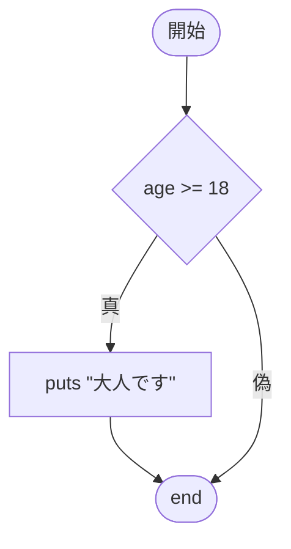

# 第3回：条件分岐 ── もし○○なら

## 今日のゴール

`if` を使って、「条件によって動きが変わる」プログラムを書けるようになる。

---

## 前回のおさらい

前回は変数を学びました。

```ruby
name = "田中"
age = 20
puts "#{name}さんは#{age}歳です"
```

今日は、この `age` の値によって表示する内容を変えます。

---

## if とは

`if` は「もし○○なら、△△する」という命令です。

```ruby
age = 20

if age >= 18
  puts "大人です"
end
```

`age >= 18` が条件です。条件が正しい（<ruby>真<rt>しん</rt></ruby>）なら、`puts "大人です"` が実行されます。

条件が正しくない（<ruby>偽<rt>ぎ</rt></ruby>）なら、何も起きません。



---

## if と else

「もし○○なら△△、そうでなければ□□」と書けます。

```ruby
age = 15

if age >= 18
  puts "大人です"
else
  puts "未成年です"
end
```

`age` が 15 なので、`age >= 18` は偽。`else` の方が実行されます。

---

## 比較の記号

条件を書くときに使う記号です：

| 記号 | 意味 | 例 |
|---|---|---|
| `==` | 等しい | `age == 20` |
| `!=` | 等しくない | `age != 20` |
| `>` | より大きい | `age > 18` |
| `<` | より小さい | `age < 18` |
| `>=` | 以上 | `age >= 18` |
| `<=` | 以下 | `age <= 18` |

注意：`=` は代入（変数に入れる）、`==` は比較（等しいか調べる）です。まったく別物です。

---

## if を2つ並べるとどうなる？

```ruby
score = 85

if score >= 60
  puts "合格"
end

if score >= 80
  puts "優秀"
end
```

実行すると「合格」と「優秀」の両方が表示されます。なぜでしょう？

`if` が2つあると、それぞれ独立して判定されます。1つ目の `if` で「合格」を表示した後、2つ目の `if` も調べて「優秀」を表示します。

「どちらか一方だけ表示したい」ときは、次の `elsif` を使います。

---

## elsif ── 3つ以上に分ける

```ruby
score = 75

if score >= 80
  puts "よくできました"
elsif score >= 60
  puts "合格です"
else
  puts "もう少しがんばりましょう"
end
```

上から順に条件を調べて、最初に正しかった方が実行されます。どれも正しくなければ `else` が実行されます。

---

## 文字列の比較

数値だけでなく、文字列も比較できます。

```ruby
weather = "雨"

if weather == "晴れ"
  puts "散歩に行こう"
else
  puts "家にいよう"
end
```

文字列の比較には `==` を使います。

---

## 条件を組み合わせる

条件を2つ組み合わせたいときは、`&&` や `||` を使います。

- `&&` ：かつ
- `||` ：または

```ruby
score = 75

if score >= 60 && score < 80
  puts "合格で、80点未満です"
end
```

この `&&` は、「60点以上で、しかも80点未満なら」という意味です。2つとも正しいときだけ実行されます。

```ruby
month = 1

if month == 12 || month == 1 || month == 2
  puts "冬です"
end
```

この `||` は、「12月、または1月、または2月なら」という意味です。どれか1つでも正しければ実行されます。

---

## キーボードから入力する

ここまでは、変数に最初から値を書いていました。

```ruby
age = 15
```

Rubyでは、キーボードから入力した値を使うこともできます。

```ruby
puts "年齢を入力してください"
age = gets.to_i

if age >= 18
  puts "大人です"
else
  puts "未成年です"
end
```

`gets` は、キーボードから入力された内容を受け取る命令です。

ただし、`gets` で受け取った内容は文字列です。今回は年齢のような数値を扱いたいので、`to_i` をつけて数値に変換しています。

この `i` は `Integer`（インテジャー、整数）の `i` です。つまり `to_i` は、「整数へ変換する」という意味です。

- `gets`：入力を受け取る
- `to_i`：文字列を数値（整数）に変換する

これで、「自分が入力した値によって結果が変わるプログラム」が書けるようになります。

---

## まとめ

今日やったこと：

1. `if` で「もし○○なら」を書いた
2. `else` で「そうでなければ」を書いた
3. `elsif` で3つ以上に分岐させた
4. 文字列も `==` で比較できることを知った
5. `&&` と `||` で条件を組み合わせられることを知った
6. `gets.to_i` で入力した数値を条件分岐に使えることを知った

覚えておくこと：

- `=` は代入、`==` は比較（別物！）
- 比較記号：`==` `!=` `>` `<` `>=` `<=`
- 条件は上から順に調べられる。最初に正しかったものだけ実行される
- `&&` は「かつ」、`||` は「または」
- `gets.to_i` を使うと、入力した数字をそのまま条件分岐に使える
