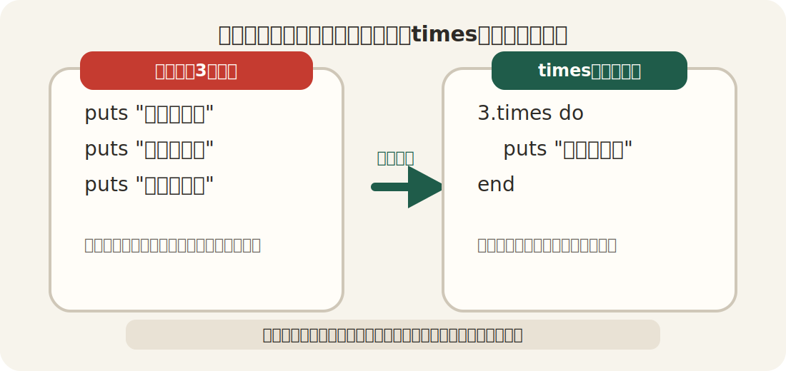
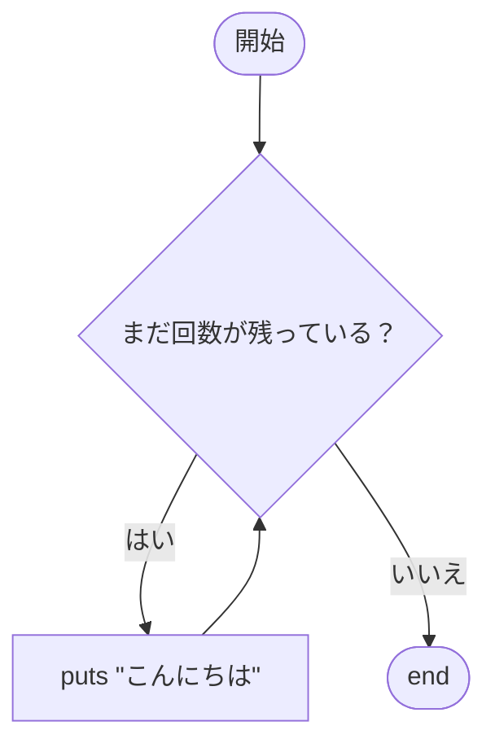
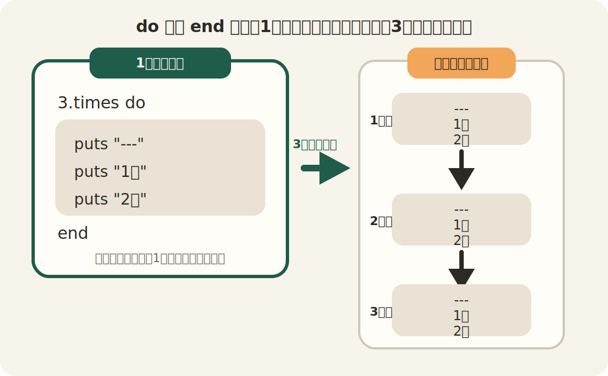
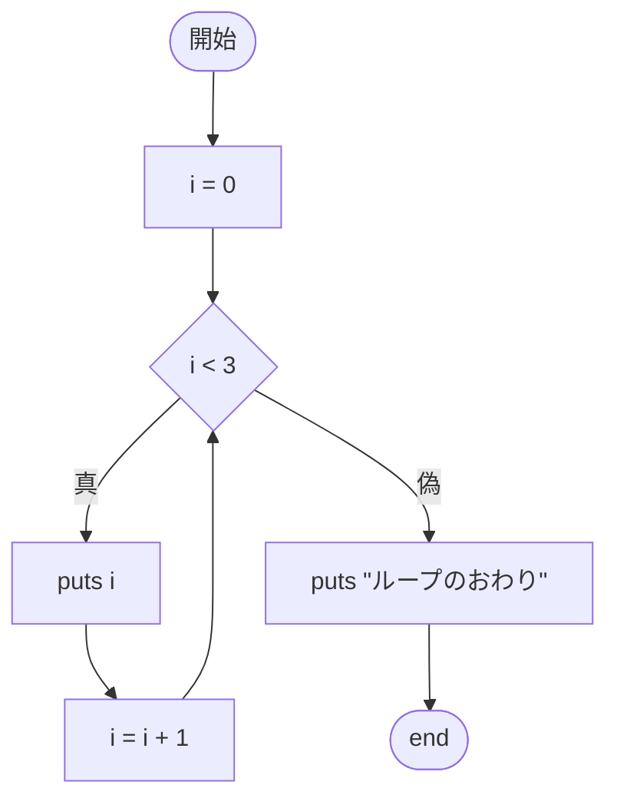

# 第4回：繰り返し ── 同じことを何回もやる

## 今日のゴール

`times` を使って、同じ処理を何回も繰り返せるようになる。

---

## 前回のおさらい

前回は `if` を使って、条件によって動きが変わるプログラムを書きました。

```ruby
age = 20

if age >= 18
  puts "大人です"
else
  puts "未成年です"
end
```

今日は、「条件で分ける」のではなく、「同じことを何回もやる」方法を学びます。

---

## なぜ繰り返しが必要なのか

たとえば、`こんにちは` を3回表示したいとします。

```ruby
puts "こんにちは"
puts "こんにちは"
puts "こんにちは"
```

これでも動きます。ただし、10回、100回となると、同じコードを何度も書くのは大変です。

そういうときに使うのが「繰り返し」です。



---

## `times` とは

`times` は、「○回繰り返す」という命令です。

```ruby
3.times do
  puts "こんにちは"
end
```

これで、`こんにちは` が3回表示されます。

意味はこうです。

- `3.times`：3回くり返す
- `do` から `end` まで：くり返す内容



---

## 上から下へ、3回くり返す

```ruby
3.times do
  puts "---"
  puts "1回"
  puts "2回"
end
```

この場合、`puts "1回"` と `puts "2回"` がセットで3回くり返されます。

つまり、`do` から `end` の中身全部が1回分です。

実行すると、次の順番で表示されます。

```
---
1回
2回
---
1回
2回
---
1回
2回
```

考え方としては、次の3回がくり返されています。

1. 1回目のくり返しで、`---`、`1回`、`2回` の順に表示する
2. 2回目のくり返しで、もう一度同じ順番で表示する
3. 3回目のくり返しで、さらに同じ順番で表示する



---

## 何回目かを使う

`times` では、「今が何回目か」を使うこともできます。

```ruby
3.times do |i|
  puts i
end
puts "ループのおわり"
```

実行すると：

```
0
1
2
ループのおわり
```

`i` には、0から順番に数が入ります。

- 1回目 → `i` は `0`
- 2回目 → `i` は `1`
- 3回目 → `i` は `2`

「3回なのに 0, 1, 2 なの？」と思うかもしれません。Rubyでは、こういう番号の付け方をよく使います。



---

## `i + 1` を使う

人間には、1回目、2回目、3回目の方がわかりやすいことがあります。

そのときは `i + 1` を使います。

```ruby
3.times do |i|
  puts "#{i + 1}回目です"
end
```

実行すると：

```
1回目です
2回目です
3回目です
```

---

## 変数といっしょに使う

`times` は変数ともいっしょに使えます。

```ruby
count = 5

count.times do
  puts "がんばる"
end
```

この場合、`がんばる` が5回表示されます。

数字を直接書くだけでなく、変数に入れて使うこともできます。

---

## 今週から来週へ

今週は、`times` を使って「同じことを何回もやる」練習をします。

来週は、配列を学びます。

配列には、たくさんのデータが入ります。配列の中身を1つずつ取り出すときに、繰り返しの考え方がまた出てきます。

つまり今週の `times` は、来週の `each` につながる準備でもあります。

---

## まとめ

今日やったこと：

1. 同じ処理を何回も書く代わりに、繰り返しを使えることを知った
2. `times` で回数を決めて繰り返せることを学んだ
3. `do` から `end` の中身全体が繰り返されることを知った
4. `|i|` を使うと何回目かを取り出せることを知った

覚えておくこと：

- `3.times do ... end` で3回繰り返す
- `do` から `end` が1まとまり
- `|i|` を使うと 0, 1, 2 ... が入る
- 人に見せるときは `i + 1` がわかりやすいことが多い
