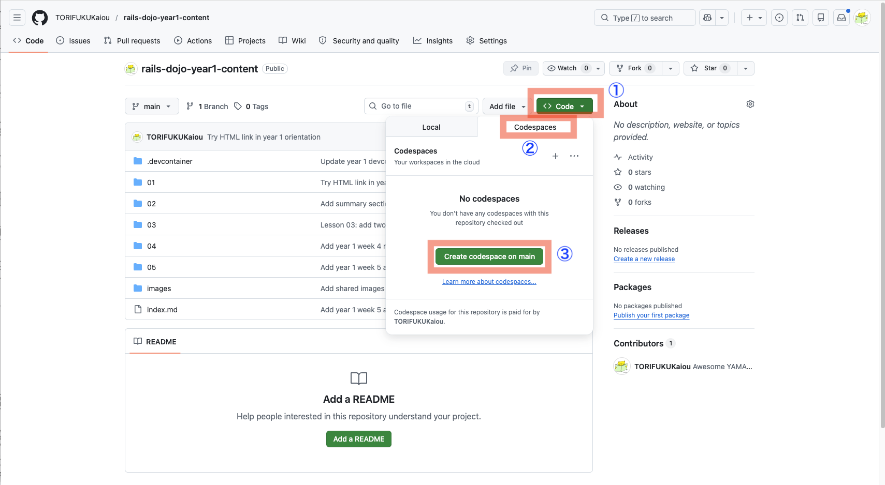
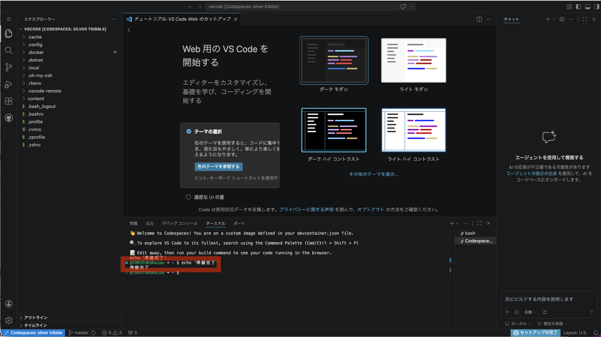
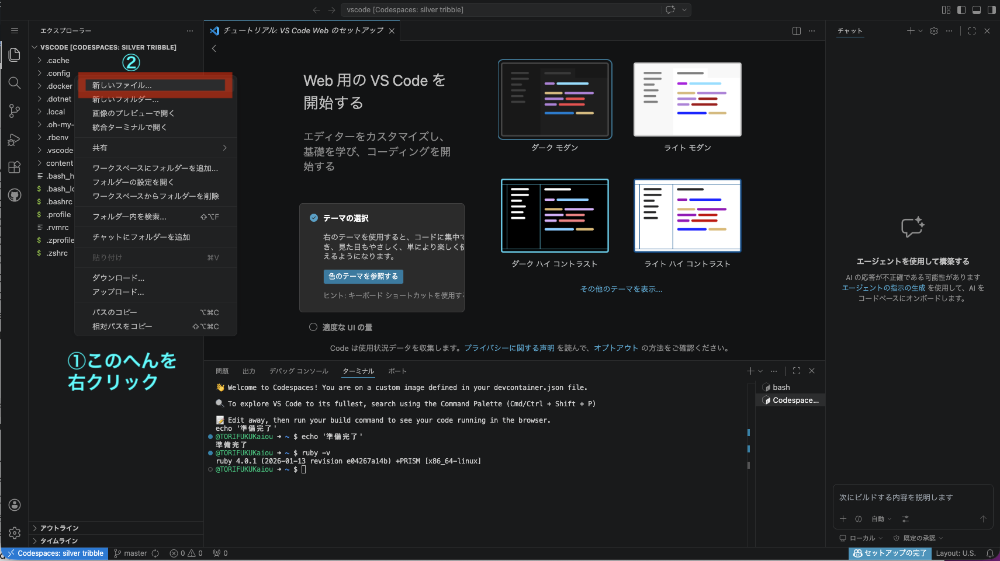

# 第4回 練習：繰り返しで遊ぼう

## 今日のゴール

`times` を使って、同じ処理を何回もくり返すプログラムを書く。

---

## この練習について

コピーすれば早く終わりますが、今は自分の手で打って慣れることの方が大事です。
特に最初のうちは、入力に慣れること自体が練習です。できるだけ自分で打って進めましょう。

---

## プログラムの基本構造（おさらい）

```
入力 → 処理 → 出力
```

今日は「処理」の部分で、同じことを何回もくり返します。

---

## 準備

<details>
<summary>前回の Codespace が残っている場合</summary>

前回の授業で Codespace を削除していないと、前回の Codespace が残っていることがあります。

- この授業では、操作に慣れるために、毎回新しい Codespace を作って始めます
- 前回の Codespace が残っている場合は、削除してから新しく作り直してください
- まっさらな状態から始めることで、準備の手順も少しずつ覚えられます
- 削除方法は [Codespace を削除する](../delete_codespace.md) を見てください（リンクを右クリックして、「新しいタブで開く」）

</details>

---

1. GitHubにログインする
2. [このリポジトリ](https://github.com/TORIFUKUKaiou/rails-dojo-year1-content/)のページを開く (リンクを右クリックして、「リンクを新しいタブで開く」)
3. 「Code」ボタン → 「Codespaces」タブ → 「Create codespace on main」をクリック

    

4. しばらく待つ（初回は1〜2分かかります）

画面が開いて、「**準備完了**」の文字が表示されたらプログラミングができる環境が整っています。



## ファイルにRubyのプログラムを書いて実行する

1. 画面左側のファイル一覧で `content` の外側、ホームディレクトリのあたりを右クリック →「新しいファイル」→ `main.rb` と入力

    

2. ファイルに以下を書く：

```ruby
puts "Hello, World!"
```

※ Codespaces 上の VS Code では、自動保存が初期設定で有効になっています。そのため、この環境では保存操作をしなくても変更は反映されます。ただし、開発環境によっては、保存しないと変更が反映されないこともあります。書き換えたら `ruby main.rb` を実行してください。

3. ターミナルで以下を実行する：

```
ruby main.rb
```

`Hello, World!` と表示されたら成功です。

ここまでできたら準備完了です。次へ進みましょう。

---

## 今日の目標（達成ライン）

- `必須（全員）`：1〜3 を終える（`times` の基本、`|i|`、`i + 1`）
- `推奨（余裕がある人）`：4〜5 に進む（変数と組み合わせる、表示を工夫する）
- `発展（早く終わった人）`：6 のチャレンジ問題に取り組む

まずは `必須` を確実に終えましょう。

---

## 1. 同じ文字を3回表示する

```ruby
3.times do
  puts "こんにちは"
end
```

### やってみよう

自分の名前を3回表示してみましょう。

<details>
<summary>解答例</summary>

```ruby
3.times do
  puts "山田太郎"
end
```

</details>

---

## 2. 何回目かを表示する

```ruby
3.times do |i|
  puts i
end
```

### やってみよう

上のコードを実行して、`0` `1` `2` と表示されることを確認しましょう。

次に、`5.times` に変えて試してみましょう。

<details>
<summary>解答例</summary>

```ruby
5.times do |i|
  puts i
end
```

</details>

---

## 3. `i + 1` で1回目から表示する

```ruby
3.times do |i|
  puts "#{i + 1}回目です"
end
```

### やってみよう

`5.times` にして、`1回目` から `5回目` まで表示してみましょう。

<details>
<summary>解答例</summary>

```ruby
5.times do |i|
  puts "#{i + 1}回目です"
end
```

</details>

---

## 4. 変数と組み合わせる

```ruby
count = 4

count.times do
  puts "Ruby!"
end
```

### やってみよう

好きな数字を変数に入れて、その回数だけ好きな言葉を表示してみましょう。

<details>
<summary>解答例</summary>

```ruby
count = 6

count.times do
  puts "がんばる"
end
```

</details>

---

## 5. くり返して形を作る

```ruby
5.times do
  puts "*****"
end
```

### やってみよう

次のような出力を作ってみましょう。

```
1回目: ***
2回目: ***
3回目: ***
4回目: ***
```

<details>
<summary>解答例</summary>

```ruby
4.times do |i|
  puts "#{i + 1}回目: ***"
end
```

</details>

---

## 6. チャレンジ問題

### その1

1から10までを表示してみましょう。

ヒント：`times` の `i` は 0 から始まるので、`i + 1` を使います。

<details>
<summary>解答例</summary>

```ruby
10.times do |i|
  puts i + 1
end
```

</details>

### その2

次の出力を作ってみましょう。

```
*
**
***
****
*****
```

ヒント：文字列も掛け算できます。

```ruby
puts "*" * 3
```

<details>
<summary>解答例</summary>

```ruby
5.times do |i|
  puts "*" * (i + 1)
end
```

</details>

### その3

7の段を、繰り返しで表示してみましょう。

```
7 x 1 = 7
7 x 2 = 14
...
7 x 9 = 63
```

<details>
<summary>解答例</summary>

```ruby
9.times do |i|
  n = i + 1
  puts "7 x #{n} = #{7 * n}"
end
```

</details>

### その4

カウントダウンを作ってみましょう。

```
5
4
3
2
1
スタート！
```

<details>
<summary>解答例</summary>

```ruby
5.times do |i|
  puts 5 - i
end

puts "スタート！"
```

</details>

### その5

自由課題。`times` を使って、自分だけのプログラムを作ってみましょう。

---

## まとめ

今日覚えたこと：

- `times` で回数を決めてくり返せる
- `do` から `end` の中身がくり返される
- `|i|` を使うと、何回目かがわかる
- `i + 1` を使うと、1回目から表示できる
- 変数と組み合わせると、回数を変えやすい

次回は「配列」を学びます。たくさんのデータをまとめて持つ方法です。
