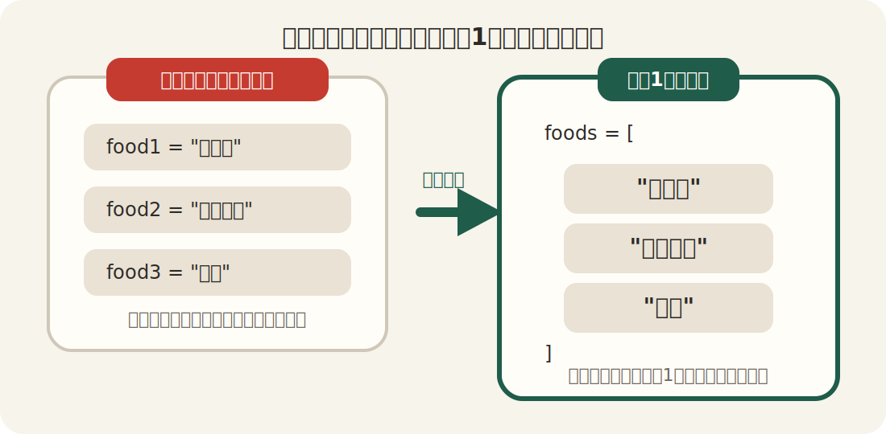
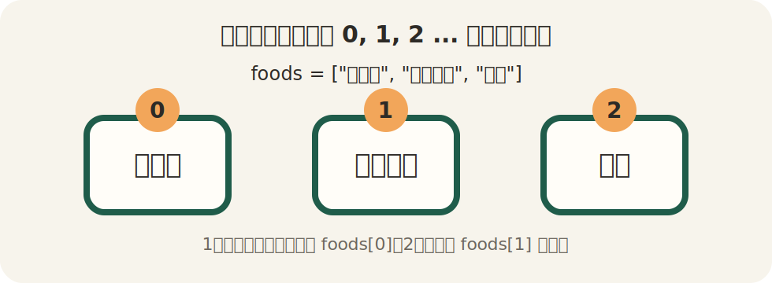

# 第5回：配列 ── たくさんのデータをまとめて持つ

## 今日のゴール

配列を使って、たくさんのデータをまとめて持てるようになる。さらに `each` を使って、中身を1つずつ取り出せるようになる。

配列の値を書き換えること、あとから追加すること、合計を出すこと、`sum` や `length` のような便利なメソッドも少し使います。
`1..10` のような範囲も扱います。

---

## 前回のおさらい

前回は `times` を使って、同じことを何回も繰り返しました。

```ruby
3.times do
  puts "こんにちは"
end
```

今日は、「同じことを何回もやる」より一歩進んで、「たくさんのデータをまとめて持つ」方法を学びます。

---

## なぜ配列が必要なのか

たとえば、好きな食べ物を3つ持ちたいとします。

```ruby
food1 = "カレー"
food2 = "ラーメン"
food3 = "寿司"
```

これでも書けます。ただし、5個、10個と増えていくと、変数がどんどん増えて管理しにくくなります。

こういうときに使うのが「配列」です。

```ruby
foods = ["カレー", "ラーメン", "寿司"]
```

これで、3つのデータを1つにまとめて持てます。



別の例で考えると、テストの点数、買い物リスト、出席番号の一覧なども、1つずつ別々の変数にするより、まとめて持った方が扱いやすくなります。

```ruby
scores = [80, 55, 100]
```

このようにしておくと、「全部を順番に見る」「合計を出す」「条件に合うものだけ表示する」といった処理につなげやすくなります。

---

## 配列とは

配列は、「順番のあるデータの集まり」です。

```ruby
foods = ["カレー", "ラーメン", "寿司"]
```

書き方のポイント：

- `[]` を使う
- データを `,` で区切る
- 順番に並んで入る

この配列には、次の3つが順番に入っています。

1. `"カレー"`
2. `"ラーメン"`
3. `"寿司"`

---

## 配列の中身を取り出す

配列の中身は、「番号」を使って取り出します。

```ruby
foods = ["カレー", "ラーメン", "寿司"]

puts foods[0]
puts foods[1]
puts foods[2]
```

実行すると：

```
カレー
ラーメン
寿司
```

大事なのは、配列の番号は `0` から始まることです。

- `foods[0]` → 1番目
- `foods[1]` → 2番目
- `foods[2]` → 3番目

前回の `times do |i|` で、`i` が `0` から始まったのと同じです。



---

## 配列の中身を書き換える

配列は、中身をあとから書き換えることもできます。

```ruby
foods = ["カレー", "ラーメン", "寿司"]

foods[1] = "うどん"

puts foods[0]
puts foods[1]
puts foods[2]
```

実行すると：

```
カレー
うどん
寿司
```

`foods[1]` は2番目です。
そこに `"うどん"` を入れると、もともと入っていた `"ラーメン"` が `"うどん"` に変わります。

---

## 配列にあとから追加する

配列には、あとからデータを追加することもできます。

```ruby
foods = ["カレー", "ラーメン", "寿司"]

foods << "うどん"

foods.each do |food|
  puts food
end
```

実行すると：

```
カレー
ラーメン
寿司
うどん
```

`foods << "うどん"` は、配列の最後に `"うどん"` を追加する書き方です。
入力した名前や点数を配列にためておきたいときにも使えます。

---

## `each` とは

配列の中身を1つずつ順番に取り出すときに使うのが `each` です。

```ruby
foods = ["カレー", "ラーメン", "寿司"]

foods.each do |food|
  puts food
end
```

実行すると：

```
カレー
ラーメン
寿司
```

意味はこうです。

- `foods.each`：`foods` の中身を1つずつ取り出す
- `|food|`：今取り出した1つを入れる変数
- `do` から `end`：取り出すたびにやること

---

## `times` と `each` の違い

どちらも繰り返しですが、意味が違います。

- `times`：回数を決めて繰り返す
- `each`：配列の中身を順番に取り出して繰り返す

たとえば：

```ruby
3.times do
  puts "こんにちは"
end
```

これは「3回」くり返しています。

```ruby
foods.each do |food|
  puts food
end
```

これは「`foods` の中身の数だけ」くり返しています。

---

## 合計を出す

配列と `each` は、合計を出すときによく使います。

```ruby
scores = [80, 55, 100]
total = 0

scores.each do |score|
  total = total + score
end

puts "合計：#{total}点"
```

実行すると：

```
合計：235点
```

`total = 0` は、合計を入れておくための変数です。
`each` で点数を1つずつ取り出し、`total = total + score` で足していきます。

この書き方は、変数の理解にも大事です。
`total` の中身が、繰り返しのたびに変わっていきます。

```ruby
total = 0
total = total + 80
total = total + 55
total = total + 100
```

このように、前の値を使って新しい値を作っています。

---

## `sum` で合計する

Rubyには、配列の中の数を合計する `sum` というメソッドもあります。

```ruby
scores = [80, 55, 100]

puts "合計：#{scores.sum}点"
```

実行すると：

```
合計：235点
```

`scores.sum` と書くと、配列の中の数をまとめて合計できます。
短く書けますが、まずは `each` で1つずつ足している動きを理解しておくことが大事です。

---

## `length` で個数を調べる

配列にデータがいくつ入っているかは、`length` で調べられます。

```ruby
scores = [80, 55, 100]

puts scores.length
```

実行すると：

```
3
```

`length` は、平均を出すときにも使えます。

```ruby
scores = [80, 55, 100]
total = scores.sum
average = total / scores.length

puts "平均：#{average}点"
```

実行すると：

```
平均：78点
```

今回は整数同士の割り算なので、小数点以下は出ません。

---

## 範囲を `each` で使う

`each` は配列だけでなく、範囲にも使えます。

```ruby
r = 1..10

r.each do |number|
  puts number
end
```

実行すると：

```
1
2
3
4
5
6
7
8
9
10
```

`1..10` は、「1から10まで」という意味です。

配列は、次のようにバラバラのデータをまとめるときに向いています。

```ruby
foods = ["カレー", "ラーメン", "寿司"]
```

範囲は、次のように連続した数字を順番に使いたいときに向いています。

```ruby
numbers = 1..10
```

`times` は「何回やるか」を先に決める書き方でした。
`each` は「中身を1つずつ取り出す」書き方です。

---

## 変数・条件分岐と一緒に使う

`each` の中では、今まで学んだことも使えます。

```ruby
scores = [80, 55, 100]

scores.each do |score|
  if score >= 60
    puts "#{score}点：合格"
  else
    puts "#{score}点：不合格"
  end
end
```

こうすると、配列の中の点数を1つずつ見ながら判定できます。

---

## 今週から来週へ

今週は、配列でたくさんのデータをまとめて持ち、`each` で順番に取り出す練習をします。

配列の値を書き換えること、あとから追加すること、合計を出すこと、`sum` や `length` を使うことも練習します。
`1..10` のような範囲も使います。連続した数字を順番に扱うときに便利です。

来週は、ハッシュを学びます。

配列は「順番で管理する」のが得意です。ハッシュは「名前で管理する」のが得意です。今週の配列を理解しておくと、次回のハッシュとの違いがよくわかります。

---

## まとめ

今日やったこと：

1. 配列でたくさんのデータをまとめて持てることを知った
2. 配列の中身を番号で取り出せることを学んだ
3. 配列の番号が `0` から始まることを確認した
4. 配列の中身を書き換えられることを知った
5. `<<` で配列にデータを追加できることを知った
6. `each` で配列の中身を1つずつ取り出せることを学んだ
7. `each` と変数を使って合計を出せることを学んだ
8. `sum` で合計、`length` で個数を調べられることを知った
9. `1..10` のような範囲を `each` で使えることを知った

> [!IMPORTANT]
> - 配列は `[]` で書く
> - 配列の番号は `0` から始まる
> - `foods[1] = "うどん"` のように書くと、配列の中身を書き換えられる
> - `foods << "うどん"` のように書くと、配列の最後に追加できる
> - `each` は配列の中身を順番に取り出す
> - `|food|` のような変数に、今の1つが入る
> - 合計を出すときは、`total = total + score` のように変数へ足していく
> - `sum` は合計、`length` は個数を調べる
> - `1..10` は1から10までの範囲を表す

[練習](practice.md) へ進みましょう。
