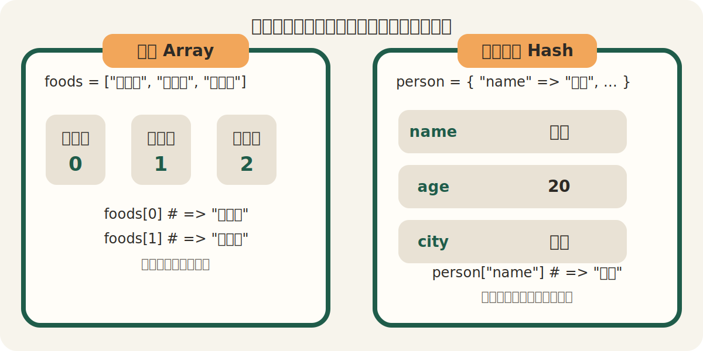

# 第6回：ハッシュ ── 名前でデータを管理する

## 今日のゴール

ハッシュを使って、データを「番号」ではなく「名前」で管理できるようになる。

---

## 前回のおさらい

前回は、配列を使ってたくさんのデータをまとめて持ちました。

```ruby
foods = ["カレー", "ラーメン", "寿司"]

puts foods[0]
puts foods[1]
```

配列は便利ですが、中身を取り出すときは `0` `1` `2` のような番号を使います。

今日は、番号ではなく「名前」で取り出せる形を学びます。

---

## なぜハッシュが必要なのか

たとえば、1人分のプロフィールを持ちたいとします。

```ruby
name = "田中"
age = 20
city = "福岡"
```

これでも書けます。ただし、これらは「1人分の情報」としてまとまっているわけではありません。

こういうときに使うのがハッシュです。

```ruby
person = { "name" => "田中", "age" => 20, "city" => "福岡" }
```

これで、`name` `age` `city` を1つにまとめて持てます。



---

## ハッシュとは

ハッシュは、「名前」と「値」をセットで持つデータです。

```ruby
person = { "name" => "田中", "age" => 20 }
```

この場合：

- `"name"` が名前
- `"田中"` が値
- `"age"` が名前
- `20` が値

このような1組を、`キーと値` と呼びます。

---

## ハッシュの書き方

書き方のポイントは次のとおりです。

- `{}` を使う
- `=>` で「名前」と「値」をつなぐ
- `,` で区切る

```ruby
person = { "name" => "田中", "age" => 20, "city" => "福岡" }
```

---

## 名前で中身を取り出す

ハッシュの中身は、キーを使って取り出します。

```ruby
person = { "name" => "田中", "age" => 20, "city" => "福岡" }

puts person["name"]
puts person["age"]
```

実行すると：

```
田中
20
```

配列が `foods[0]` のように番号で取り出したのに対して、ハッシュは `person["name"]` のように名前で取り出します。

---

## 値を書き換える・追加する

ハッシュは、あとから値を書き換えたり、新しい情報を追加したりできます。

```ruby
person = { "name" => "田中", "age" => 20 }

person["age"] = 21
person["city"] = "福岡"
```

この場合：

- `age` は `20` から `21` に書き換わる
- `city` は新しく追加される

---

## `each` で全部見る

ハッシュも `each` で1つずつ見られます。

```ruby
person = { "name" => "田中", "age" => 20, "city" => "福岡" }

person.each do |key, value|
  puts "#{key}: #{value}"
end
```

実行すると：

```
name: 田中
age: 20
city: 福岡
```

今回は、`key` に名前、`value` に値が入ります。

---

## 配列とハッシュの違い

- 配列：順番で管理する
- ハッシュ：名前で管理する

たとえば：

- 好きな食べ物を3つ持つ → 配列が向いている
- 1人分の名前・年齢・出身地を持つ → ハッシュが向いている

どちらも「たくさんのデータをまとめる」道具ですが、得意なことが違います。

---

## 今週から来週へ

今週は、ハッシュで「名前を使って値を取り出す」練習をします。

来週は、メソッドを学びます。

ハッシュも配列も、メソッドの中で使えるようになると、プログラムが少しずつ整理されていきます。今週までに、配列とハッシュの違いを押さえておくことが大事です。

---

## まとめ

今日やったこと：

1. ハッシュで1人分の情報をまとめて持てることを知った
2. ハッシュはキーを使って値を取り出すことを学んだ
3. 値の書き換えや追加ができることを知った
4. `each` でキーと値を順番に見られることを学んだ

覚えておくこと：

- ハッシュは `{}` で書く
- `=>` でキーと値をつなぐ
- 配列は番号、ハッシュは名前で取り出す
- `each do |key, value|` で全部見られる

[練習](practice.md) へ進みましょう。
