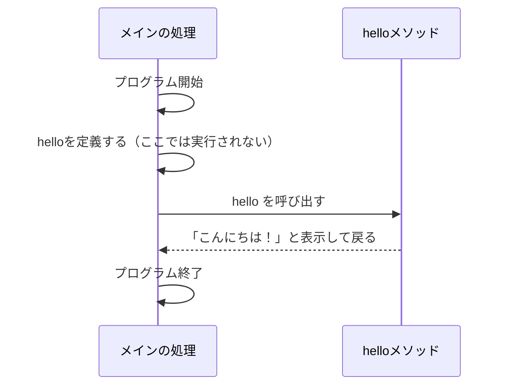
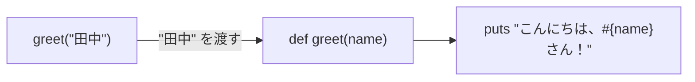

# 第7回：メソッド ── 処理に名前をつける

## 今日のゴール

自分で「メソッド」を作り、呼び出せるようになる。
引数を使って外から値を渡し、戻り値を使って結果を受け取れるようになる。

---

## 前回のおさらい

前回は、ハッシュを使ってデータを「名前」で管理しました。

```ruby
person = { "name" => "田中", "age" => 20 }
puts person["name"]
```

これまでに、変数、条件分岐（`if`）、繰り返し（`times`）、配列、ハッシュなど、たくさんの書き方を学びました。

また、配列の合計を出す `scores.sum` や、データの数を数える `scores.length` なども使ってきました。この `sum` や `length` は、Rubyにあらかじめ用意されている「メソッド」と呼ばれるものです。

今日は、このような「メソッド」を**自分自身で作る**方法を学びます。

---

## なぜメソッドが必要なのか

プログラミングをしていると、同じような処理を何度も書くことがあります。

たとえば、丁寧な挨拶を3人にしたいとします。

```ruby
puts "-----------------"
puts "こんにちは、田中さん。"
puts "今日も良い天気ですね。"
puts "-----------------"

puts "-----------------"
puts "こんにちは、佐藤さん。"
puts "今日も良い天気ですね。"
puts "-----------------"

puts "-----------------"
puts "こんにちは、鈴木さん。"
puts "今日も良い天気ですね。"
puts "-----------------"
```

これでも動きますが、ほとんど同じ文章なのに、相手の「名前」が違うだけで何度も同じようなコードを書くのは大変です。

第2回で「データ」を使い回すために**変数**を学びました。
今回は「処理」を使い回すために**メソッド**を使います。

---

## メソッドとは

変数が「データ」につける名前だとすれば、メソッドは「処理（やること）」につける名前です。

- **変数**：データに名前をつける
- **メソッド**：処理に名前をつける

先ほどの挨拶も、メソッドを使えば次のようにスッキリ書くことができます。

```ruby
def greet(name)
  puts "-----------------"
  puts "こんにちは、#{name}さん。"
  puts "今日も良い天気ですね。"
  puts "-----------------"
end

greet("田中")
greet("佐藤")
greet("鈴木")
```

このように、呼び出すときに渡す値（`"田中"` など）を変えるだけで、それがメソッドの中の `name` という変数に埋め込まれ、相手に合わせた挨拶が表示されます。

---

## メソッドの作り方と呼び出し方

メソッドは、`def` と `end` で囲んで作ります。

```ruby
def hello
  puts "こんにちは！"
end
```

### ❓ 考えてみよう

このコードを書いたファイルを実行すると、何が表示されるでしょうか？

<details>
<summary>答え</summary>

**何も表示されません。**

</details>

### なぜ何も表示されないのか

メソッドは「定義した（作った）」だけでは動きません。
「呼び出す（使う）」ことで初めて動きます。



呼び出すには、メソッドの名前を書きます。

```ruby
# メソッドを作る（定義する）
def hello
  puts "こんにちは！"
end

# メソッドを使う（呼び出す）
hello
```

コードは上から下へ進みますが、`hello` と呼ばれた瞬間に、`def hello` の中へ処理がジャンプします。終わると元の場所へ戻ってきます。

---

## 引数（ひきすう） ── 外から値を渡す

メソッドという箱の中に、外から材料（データ）を渡すことができます。この材料を**引数**と呼びます。

```ruby
def greet(name)
  puts "こんにちは、#{name}さん！"
end

greet("田中")
greet("佐藤")
```

このとき、`"田中"` という値が、メソッドの中の `name` という変数に入ります。



### ❓ 考えてみよう

次のように引数を変えると、実行結果はどうなるでしょうか？

```ruby
def double(number)
  puts number * 2
end

double(5)
double(10)
```

<details>
<summary>答え</summary>

```text
10
20
```

</details>

---

## 戻り値（もどりち） ── 結果を返す

メソッドは、計算した結果などを呼び出し元に「返す」ことができます。
これを**戻り値**と呼びます。

自動販売機をイメージしてください。
お金（引数）を入れると、ジュース（戻り値）が出てきます。

Rubyでは、**「メソッドの中で最後に書かれた値」が自動的に戻り値になります。**

```ruby
def add(a, b)
  a + b
end

result = add(3, 5)
puts result
```

この場合、`3 + 5` の結果である `8` が、呼び出し元に戻ります。
そして、その `8` が `result` という変数に代入されます。

### puts と 戻り値の違い

ここで、`puts` と 戻り値 の違いを整理しておきましょう。

- `puts`：画面に文字を**表示するだけ**。データとしては使えない。
- 戻り値：データとして**返す**。変数に入れたり、計算に使ったりできる。

### ❓ 考えてみよう

次のコードは、どちらも「8」が関わりますが、何が違うでしょうか。

```ruby
# Aのパターン
def calc_a
  puts 3 + 5
end
answer_a = calc_a()

# Bのパターン
def calc_b
  3 + 5
end
answer_b = calc_b()
```

<details>
<summary>答え</summary>

Aは、画面に `8` と表示されますが、`answer_a` には空っぽ（`nil`）が入ります。あとから計算に使えません。
これは、**`puts` というメソッド自体の戻り値が `nil` だから**です。

Bは、画面には何も表示されませんが、`answer_b` の中に `8` というデータが入ります。

</details>

> [!TIP]
> **`nil`（ニル）とは**
> Rubyで「何もない」「空っぽ」であることを表す特別な値です。
> `puts` は「画面に表示する」という仕事をするだけで、データは返さないため、戻り値としてこの `nil` を返します。

> [!NOTE]
> `return a + b` のように `return` という言葉を使って戻り値を書く言語もたくさんあります。Rubyでも使えますが、省略して書くのが一般的です。

---

## スコープ ── 変数の見えない壁

最後に、メソッドを使う上でとても大切なルールがあります。
それは**「メソッドには見えない壁がある」**ということです。

メソッドの外で作った変数は、メソッドの中では使えません。

### ❓ 考えてみよう

次のコードを実行するとどうなるでしょうか？

```ruby
message = "こんにちは"

def say_hello
  puts message
end

say_hello
```

<details>
<summary>答え</summary>

**エラーになります** (`undefined local variable or method 'message'`)

</details>

なぜエラーになるのでしょうか。
`message` はメソッドの「外」で作られた変数だからです。メソッドの「中」からは壁に阻まれて見えません。

外のデータを使いたい場合は、**引数として壁を越えさせる**必要があります。

```ruby
message = "こんにちは"

# 引数 text として受け取る
def say_hello(text)
  puts text
end

# 引数として渡す
say_hello(message)
```

この「メソッドの中と外は別の空間である」という感覚は、これからのプログラミングでずっと重要になります。

---

## まとめ

今日やること：

1. `def` 〜 `end` でメソッドを作り、呼び出す。
2. 引数を使って、メソッドの外から中へデータを渡す。
3. 最後に評価された値を、戻り値として受け取る。
4. メソッドの壁（スコープ）を意識する。

メソッドを使えるようになると、プログラムが劇的に読みやすく、書きやすくなります。練習問題に進みましょう！
