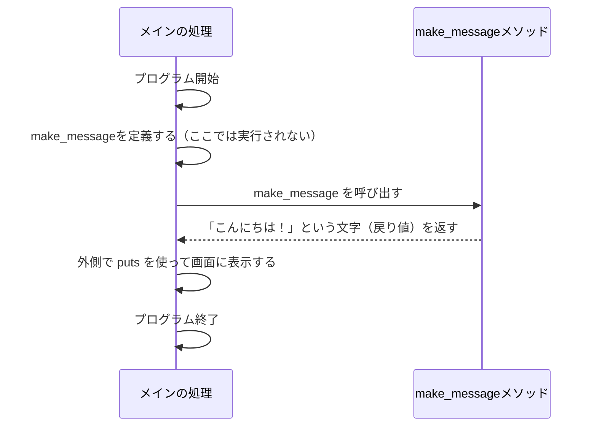
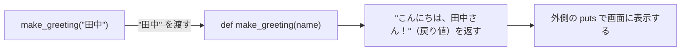

# 第7回：メソッド ── 処理に名前をつける

## 今日のゴール

自分で「メソッド」を作り、呼び出せるようになる。
引数を使って外から値を渡し、戻り値を使って結果を受け取れるようになる。

---

## 前回のおさらい

前回は、ハッシュを使ってデータを「名前」で管理しました。

```ruby
person = { "name" => "田中", "age" => 20 }
puts person["name"]
```

これまでに、変数、条件分岐（`if`）、繰り返し（`times`）、配列、ハッシュなど、たくさんの書き方を学びました。

また、配列の合計を出す `scores.sum` や、データの数を数える `scores.length` なども使ってきました。この `sum` や `length` は、Rubyにあらかじめ用意されている「メソッド」と呼ばれるものです。

今日は、このような「メソッド」を**自分自身で作る**方法を学びます。

---

## なぜメソッドが必要なのか

プログラミングをしていると、同じような処理を何度も書くことがあります。

たとえば、丁寧な挨拶を3人にしたいとします。

```ruby
puts "-----------------"
puts "こんにちは、田中さん。"
puts "今日も良い天気ですね。"
puts "-----------------"

puts "-----------------"
puts "こんにちは、佐藤さん。"
puts "今日も良い天気ですね。"
puts "-----------------"

puts "-----------------"
puts "こんにちは、鈴木さん。"
puts "今日も良い天気ですね。"
puts "-----------------"
```

これでも動きますが、ほとんど同じ文章なのに、相手の「名前」が違うだけで何度も同じようなコードを書くのは大変です。

第2回で「データ」を使い回すために**変数**を学びました。
今回は「処理」を使い回すために**メソッド**を使います。

---

## メソッドとは

変数が「データ」につける名前だとすれば、メソッドは「処理（やること）」につける名前です。

- **変数**：データに名前をつける
- **メソッド**：処理に名前をつける

先ほどの挨拶も、メソッドを使えば次のようにスッキリ書くことができます。

```ruby
# 挨拶のカード（文字列）を作って返すメソッド
def make_greeting(name)
  "-----------------\nこんにちは、#{name}さん。\n今日も良い天気ですね。\n-----------------"
end

puts make_greeting("田中")
puts make_greeting("佐藤")
puts make_greeting("鈴木")
```

> [!NOTE]
> **`\n`（バックスラッシュ エヌ）とは**
> 文字列の中で「改行」を表す特別な記号です。
> `"1行目\n2行目"` と書くと、`\n` の部分で改行され、画面には2行に分かれて表示されます。
> メソッドの中でこの `\n` を使うことで、罫線（`---`）も含めた「複数行のきれいな挨拶カード」を1つの塊として組み立てて返すことができます。

このコードでは、呼び出すときに渡す値（`"田中"` など）を変えるだけで、メソッドがそれぞれの相手に合わせたきれいな挨拶カード（複数行の文字列）を作って返してくれます。画面への表示は、メソッドの「外側」にある `puts` が1行でシンプルに行っています。

---

## メソッドの作り方と呼び出し方

メソッドは、`def` と `end` で囲んで作ります。

```ruby
def make_message
  "こんにちは！"
end
```

### ❓ 考えてみよう

このコードを書いたファイルを実行すると、何が表示されるでしょうか？

<details>
<summary>答え</summary>

**何も表示されません。**

</details>

### なぜ何も表示されないのか

メソッドは「定義した（作った）」だけでは動きません。
「呼び出す（使う）」ことで初めて動きます。

さらに、このメソッドの中には画面に表示する命令（`puts`）がありません。メソッドは `"こんにちは！"` という文字（戻り値）を**返すだけ**の役割になっています。

画面に表示するには、メソッドを「呼び出し」、その結果を「表示する（`puts`）」必要があります。



呼び出すには、メソッドの名前を書きます。

```ruby
# メソッドを作る（定義する）
def make_message
  "こんにちは！"
end

# メソッドを使い（呼び出し）、結果を puts で表示する
puts make_message
```

コードは上から下へ進みますが、`make_message` と呼ばれた瞬間に、`def make_message` の中へ処理がジャンプします。終わると元の場所へ戻ってきて、返ってきた文字列を `puts` が画面に表示します。

---

## 引数（ひきすう） ── 外から値を渡す

メソッドという箱の中に、外から材料（データ）を渡すことができます。この材料を**引数**と呼びます。

```ruby
def make_greeting(name)
  "こんにちは、#{name}さん！"
end

puts make_greeting("田中")
puts make_greeting("佐藤")
```

このとき、`"田中"` という値が、メソッドの中の `name` という変数に入り、組み立てられた挨拶の文字列が戻ってきます。それを外側の `puts` が表示します。



### ❓ 考えてみよう

次のように引数を変えると、実行結果はどうなるでしょうか？

```ruby
def double(number)
  number * 2
end

puts double(5)
puts double(10)
```

<details>
<summary>答え</summary>

```text
10
20
```

</details>

---

## 戻り値（もどりち） ── 結果を返す

メソッドは、計算した結果などを呼び出し元に「返す」ことができます。
これを**戻り値**と呼びます。

自動販売機をイメージしてください。
お金（引数）を入れると、ジュース（戻り値）が出てきます。

Rubyでは、**「メソッドの中で最後に実行され、評価された式の値」が自動的に戻り値になります。**

```ruby
def add(a, b)
  a + b
end

result = add(3, 5)
puts result
```

この場合、`3 + 5` の結果である `8` が、呼び出し元に戻ります。
そして、その `8` が `result` という変数に代入され、外側の `puts` で表示されます。

### puts と 戻り値の違い

ここで、`puts` と 戻り値 の違いを整理しておきましょう。

- `puts`：渡された値を画面に**表示する**。`puts` 自体の戻り値は `nil`。
- 戻り値：メソッドの結果として**返す**。変数に入れたり、計算に使ったりできる。

### ❓ 考えてみよう

次のコードは、どちらも「8」が関わりますが、何が違うでしょうか。

> [!IMPORTANT]
> 次の A のパターンは、`puts` 自体の戻り値を確認するための比較用コードです。
> この授業で自分でメソッドを作るときは、基本的にメソッドから値を返し、表示はメソッドの外側で行います。

```ruby
# Aのパターン
def calc_a
  puts 3 + 5
end
answer_a = calc_a
p answer_a

# Bのパターン
def calc_b
  3 + 5
end
answer_b = calc_b
p answer_b
```

<details>
<summary>答え</summary>

実行すると、次のように表示されます。

```text
8
nil
8
```

最初の `8` は、`calc_a` の中にある `puts 3 + 5` が表示したものです。
次の `nil` は、`p answer_a` で変数の中身を確認した結果です。`answer_a` には `nil` が入っています。
これは、**`puts` というメソッド自体の戻り値が `nil` だから**です。

最後の `8` は、`p answer_b` で変数の中身を確認した結果です。
`calc_b` は画面には何も表示しませんが、`answer_b` の中に `8` というデータが入ります。

`p` は、値の中身をそのまま確認するために使っています。

</details>

> [!TIP]
> **`nil`（ニル）とは**
> Rubyで「何もない」「空っぽ」であることを表す特別な値です。
> `puts` は「画面に表示する」という仕事をするだけで、データは返さないため、戻り値としてこの `nil` を返します。

> [!NOTE]
> `return a + b` のように `return` という言葉を使って戻り値を書く言語もたくさんあります。Rubyでも使えますが、省略して書くのが一般的です。

---

## メソッドの中で別のメソッドを使う

メソッドの中から、すでに作った別のメソッドを呼び出すこともできます。

たとえば、送料を加えた金額を計算するメソッドと、その金額を文章にするメソッドを分けて作ります。どちらも内部では `puts` を使わず、値を返すように設計します。

```ruby
def add_shipping_fee(price)
  price + 200
end

def make_total_message(price)
  total = add_shipping_fee(price)
  "合計金額は#{total}円です"
end

message = make_total_message(500)
puts message
```

実行すると：

```text
合計金額は700円です
```

このコードは、次の順番で動きます。

1. `make_total_message(500)` が呼び出される。
2. メソッドの中で `add_shipping_fee(500)` が呼び出される。
3. `add_shipping_fee` の戻り値 `700` が、`total` に入る。
4. `make_total_message` が文章を戻り値として返す。
5. 外側の `puts message` が文章を表示する。

「金額を計算する処理」と「文章を作る処理」のように、役割ごとにメソッドを分け、表示は一番外側で行うようにすると、何をしているコードなのか読み取りやすく、他の場所でも処理を再利用しやすくなります。

---

## スコープ ── 変数の見えない壁

最後に、メソッドを使う上でとても大切なルールがあります。
それは**「メソッドには見えない壁がある」**ということです。

メソッドの外で作った変数は、メソッドの中では使えません。

> [!IMPORTANT]
> 次のコードは、メソッドの外で作った変数を中から直接使おうとするとエラーになることを確認する例です。
> 実行するとエラーになりますが、ここではそのエラーが表示されれば確認成功です。

### ❓ 考えてみよう

次のコードを実行するとどうなるでしょうか？

```ruby
message = "こんにちは"

def get_message
  message
end

puts get_message
```

<details>
<summary>答え</summary>

**エラーになります** (`undefined local variable or method 'message'`)

</details>

なぜエラーになるのでしょうか。
`message` はメソッドの「外」で作られた変数だからです。メソッドの「中」からは壁に阻まれて見えないため、外側の `message` の値を直接取り出して返すことはできません。

外のデータを使いたい場合は、**引数として壁を越えさせる**必要があります。

```ruby
message = "こんにちは"

# 外側の message を、引数 text として受け取る
def get_message(text)
  text
end

# 引数として渡して呼び出し、戻り値を表示する
puts get_message(message)
```

こうすることで、外側の `message` に入っている `"こんにちは"` という値を、引数 `text` としてメソッドに渡せます。メソッドは受け取った `text` の値を返せるようになります。

この「メソッドの中と外は別の空間である」という感覚は、これからのプログラミングでずっと重要になります。

---

## まとめ

今日学んだこと：

1. **戻り値を基本とする**：自作メソッドは計算結果や文章などの値を「戻り値」として返し、画面への表示はメソッドの**外側**で `puts` を使う。
2. **引数の利用**：引数を使うことで、メソッドの外から中へデータを渡すことができる。
3. **処理の再利用**：メソッドは値を返すように作るため、変数に代入したり、別のメソッドの処理に組み込んだりして再利用できる。
4. **スコープ（変数の見えない壁）**：メソッドの中と外は独立した空間であるため、外の変数を中で使いたいときは必ず引数として渡す。

メソッドを正しく使えるようになると、プログラムが劇的に読みやすく、再利用しやすくなります。練習問題に進みましょう！

[練習](practice.md) へ進みましょう。
