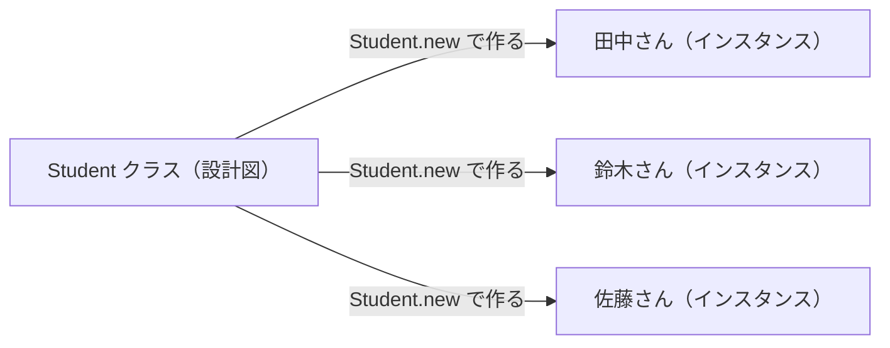
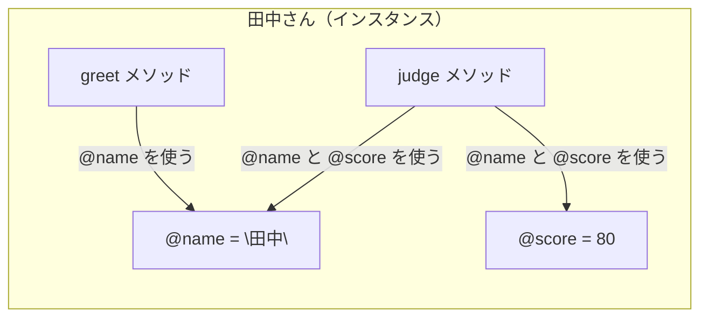
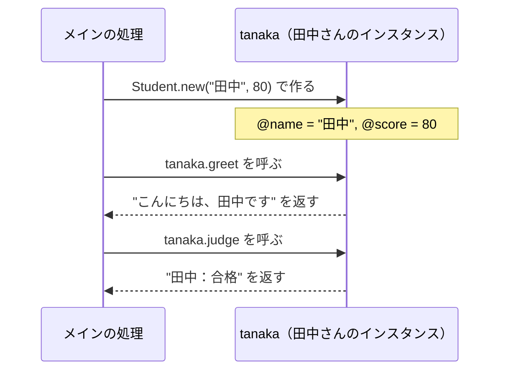

# 第8回：クラス入門 ── データとメソッドをひとまとめにする

## 今日のゴール

クラスを使って、データと、そのデータに対する処理を1つにまとめられるようになる。

「クラス」と「インスタンス」の違いをつかみ、自分でクラスを定義して使えるようになる。

---

## 前回のおさらい

前回は、処理に名前をつける「メソッド」を学びました。

```ruby
def make_greeting(name)
  "こんにちは、#{name}さん！"
end

puts make_greeting("田中")
```

メソッドを使うと、同じ処理を何度も使い回せます。

今日は、このメソッドをさらに一歩進めます。  
メソッドだけでなく、「データ」もいっしょにまとめる仕組みを学びます。それが**クラス**です。

---

## なぜクラスが必要なのか

前回、学生1人の情報をハッシュで表しました。

```ruby
student = { "name" => "田中", "score" => 80 }
```

そして、その点数を評価するメソッドを別に書くとします。

```ruby
def judge(score)
  if score >= 60
    "合格"
  else
    "不合格"
  end
end
```

使うときはこうなります。

```ruby
student = { "name" => "田中", "score" => 80 }
puts judge(student["score"])
```

これで動きます。でも、「田中さんのデータ」と「それを判定するメソッド」は、コード上ではバラバラです。

複数の学生が増えてきたとき、データとメソッドの関係が見えにくくなります。

**クラスを使うと、データとそれに関連するメソッドを1つにまとめられます。**

---

## クラスとインスタンスとは

まず、大事な言葉を2つ覚えます。

| 言葉 | 意味 | 例 |
|---|---|---|
| **クラス** | データとメソッドの「設計図」 | `Student` クラス |
| **インスタンス** | その設計図から作った「実物」 | 田中さん、鈴木さん、... |

クラスはあくまで「設計図」です。クラスを定義しただけでは、具体的なデータはまだ存在しません。

「設計図から実物を作る」操作を**インスタンス化**と呼びます。



---

## クラスを書いてみよう

次のファイルを作ってください。

**ファイル名：`main.rb`**（既存のファイルがあれば中身を書き換えてください）

```ruby
class Student
  def initialize(name, score)
    @name = name
    @score = score
  end

  def greet
    "こんにちは、#{@name}です"
  end

  def judge
    if @score >= 60
      "#{@name}：合格"
    else
      "#{@name}：不合格"
    end
  end
end

tanaka = Student.new("田中", 80)
puts tanaka.greet
puts tanaka.judge

suzuki = Student.new("鈴木", 45)
puts suzuki.greet
puts suzuki.judge
```

ターミナルで実行します。

```
ruby main.rb
```

実行すると：

```text
こんにちは、田中です
田中：合格
こんにちは、鈴木です
鈴木：不合格
```

---

## クラスの構成を読む

今書いたコードを、1つずつ見ていきます。

### クラスの定義

```ruby
class Student
  # ...
end
```

`class クラス名` で始まり、`end` で終わります。クラス名は**大文字**で始めるのがRubyのルールです。

### `initialize` メソッド ── インスタンスを作るときに呼ばれる

```ruby
def initialize(name, score)
  @name = name
  @score = score
end
```

`Student.new("田中", 80)` と書いたとき、自動的に呼ばれるメソッドです。  
渡した値（`"田中"` と `80`）が、引数 `name` と `score` に入ります。

### インスタンス変数（`@` で始まる変数）

```ruby
@name = name
@score = score
```

`@` で始まる変数を**インスタンス変数**と呼びます。

第7回で学んだ「スコープ（変数の見えない壁）」を思い出してください。  
普通の変数は、そのメソッドの中でしか使えませんでした。

インスタンス変数は違います。同じインスタンスのメソッドからなら、どこからでも使えます。



### インスタンスメソッド

```ruby
def greet
  "こんにちは、#{@name}です"
end

def judge
  if @score >= 60
    "#{@name}：合格"
  else
    "#{@name}：不合格"
  end
end
```

クラスの中で定義したメソッドを**インスタンスメソッド**と呼びます。  
`@name` や `@score` を使えるのが、普通のメソッドとの違いです。

---

## インスタンスを作って使う

```ruby
tanaka = Student.new("田中", 80)
puts tanaka.greet
puts tanaka.judge
```

- `Student.new("田中", 80)` で「田中さん」というインスタンスを作り、変数 `tanaka` に入れる
- `tanaka.greet` で、田中さんのインスタンスに対して `greet` メソッドを呼ぶ
- `tanaka.judge` で、同じく `judge` メソッドを呼ぶ

インスタンスメソッドは、`インスタンス名.メソッド名` の形で呼び出します。  
これは `scores.sum` や `foods.each` と同じ書き方です。



---

## Railsのモデルと同じ構造

ここで1つ、後半の授業で出てくるものを少しだけ紹介します。

後期のRails授業では、次のようなコードを書きます。

```ruby
article = Article.new
article.title = "はじめての記事"
article.save
```

これは、`Article` というクラスのインスタンスを作り、`title` に文字を入れて、データベースに保存する操作です。

**`Article` はクラスです。`article` はそのインスタンスです。**

Rubyのクラスを理解していると、Railsが何をしているか読めるようになります。

---

## ❓ 考えてみよう（1）

次のコードを読んで、実行結果を予測してから実行してみましょう。

```ruby
class Product
  def initialize(name, price)
    @name = name
    @price = price
  end

  def info
    "#{@name}：#{@price}円"
  end
end

ramen = Product.new("ラーメン", 800)
sushi = Product.new("寿司", 1200)

puts ramen.info
puts sushi.info
```

<details>
<summary>実行結果</summary>

```text
ラーメン：800円
寿司：1200円
```

`ramen` と `sushi` はそれぞれ別のインスタンスです。  
同じ `info` メソッドを呼んでも、インスタンスごとに `@name` と `@price` が違うので、結果が変わります。

</details>

---

## ❓ 考えてみよう（2）

次のコードを実行するとどうなるでしょうか？

```ruby
class Counter
  def initialize
    @count = 0
  end

  def up
    @count = @count + 1
  end

  def show
    "現在の回数：#{@count}"
  end
end

c = Counter.new
puts c.show
c.up
c.up
c.up
puts c.show
```

<details>
<summary>実行結果</summary>

```text
現在の回数：0
現在の回数：3
```

`@count` はインスタンス変数なので、`up` を呼ぶたびに値が積み上がっていきます。  
インスタンスが「状態を持てる」ことがよく分かる例です。

</details>

---

## まとめ

今日学んだこと：

1. **クラスは設計図**：データとメソッドをひとまとめにする仕組み
2. **インスタンス化**：`クラス名.new` で実物を作る
3. **`initialize`**：`new` したとき自動的に呼ばれ、インスタンス変数に値を入れる
4. **インスタンス変数（`@` で始まる）**：同じインスタンス内のメソッドからどこでも使える
5. **インスタンスメソッド**：`インスタンス名.メソッド名` の形で呼ぶ

> [!IMPORTANT]
> - クラス名は大文字で始める
> - `initialize` は `new` するときに自動で呼ばれる
> - `@変数名` はインスタンスの中で共有される変数
> - インスタンスメソッドは `オブジェクト.メソッド名` で呼ぶ

[練習](practice.md) へ進みましょう。
