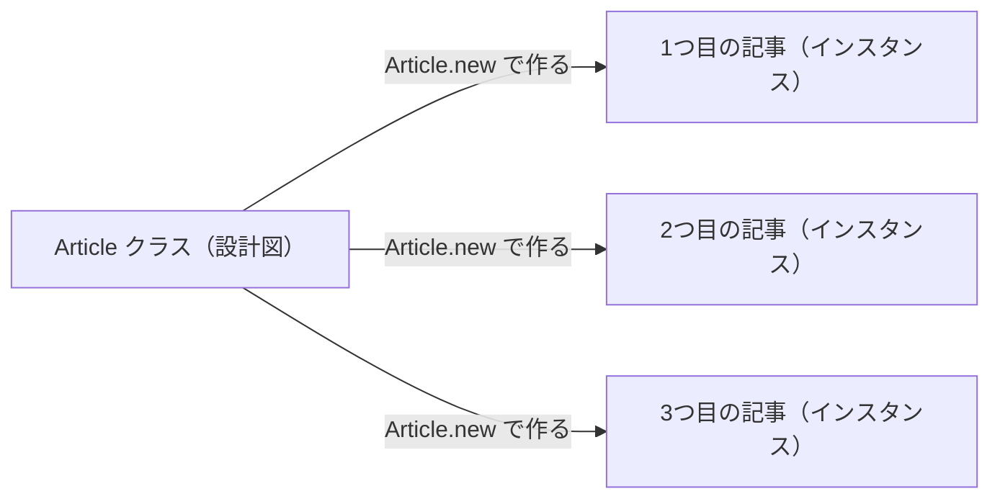
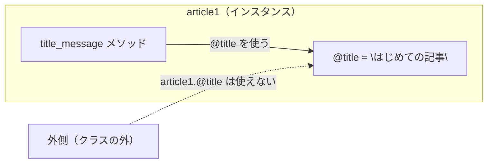

# 第8回：クラス入門 ── データとメソッドをひとまとめにする

## 今日のゴール

クラスを使って、データと処理を1つにまとめられるようになる。

「クラス」と「インスタンス」の違いをつかみ、自分でクラスを定義して使えるようになる。

---

## 前回のおさらい

前回は、処理に名前をつける「メソッド」を学びました。

```ruby
def make_greeting(name)
  "こんにちは、#{name}さん！"
end

puts make_greeting("田中")
```

メソッドを使うと、同じ処理を何度も使い回せます。

今日は、このメソッドをさらに一歩進めます。  
メソッドだけでなく、「データ」もいっしょにまとめる仕組みを学びます。それが**クラス**です。

---

## なぜクラスが必要なのか

これまでに、1件分のデータをハッシュで表す方法を学びました。たとえば記事のデータをハッシュで表すと、次のようになります。

```ruby
article = { "title" => "はじめての記事", "body" => "Rubyを学んでいます" }
```

そして、記事のタイトルを表示するメソッドを別に書くとします。

```ruby
def show_title(article)
  "記事タイトル：#{article["title"]}"
end
```

使うときはこうなります。

```ruby
article = { "title" => "はじめての記事", "body" => "Rubyを学んでいます" }
puts show_title(article)
```

これで動きます。でも、「記事のデータ」と「それを扱うメソッド」は、コード上では離れた場所にあります。

記事が増えてくると、どのメソッドがどのデータのためのものか、見えにくくなります。

**クラスを使うと、データとそれに関連するメソッドを1つにまとめられます。**

---

## クラスとインスタンスとは

まず、大事な言葉を2つ覚えます。

| 言葉 | 意味 | 例 |
|---|---|---|
| **クラス** | データとメソッドの「設計図」 | `Article` クラス |
| **インスタンス** | その設計図から作った「実物」 | 1つ目の記事、2つ目の記事、... |

クラスはあくまで「設計図」です。クラスを定義しただけでは、具体的なデータはまだ存在しません。

「設計図から実物を作る」操作を**インスタンス化**と呼びます。



---

## ステップ1：クラスの中にメソッドを書く

まず、一番シンプルな形からはじめます。

次のファイルを作ってください。

**ファイル名：`main.rb`**（既存のファイルがあれば中身を書き換えてください）

```ruby
class Article
  def title_message
    "これは記事です"
  end
end

article = Article.new
puts article.title_message
```

ターミナルで実行します。

```
ruby main.rb
```

実行すると：

```text
これは記事です
```

ポイントは2つです。

- `class Article` と `end` で囲んで、クラスを定義している
- `Article.new` でインスタンスを作り、`.title_message` でメソッドを呼んでいる

クラス名は**大文字**で始めるのがRubyのルールです。

インスタンスメソッドは、`インスタンス名.メソッド名` の形で呼び出します。  
これは `scores.sum` や `foods.each` と同じ書き方です。

> [!NOTE]
> クラス名を `article`（小文字）ではなく `Article`（大文字）で始めるのは、変数との区別をつけるためです。`article` はインスタンス（実物）、`Article` はクラス（設計図）です。

---

## ステップ2：`initialize` とインスタンス変数

今の `title_message` は、どのインスタンスでも同じ文字を返します。  
記事ごとに違うタイトルを持たせるには、データを渡す仕組みが必要です。

`main.rb` を次のように書き換えてください。

```ruby
class Article
  def initialize(title)
    @title = title
  end

  def title_message
    "記事タイトル：#{@title}"
  end
end

article1 = Article.new("はじめての記事")
puts article1.title_message

article2 = Article.new("Rubyを学ぶ")
puts article2.title_message
```

実行すると：

```text
記事タイトル：はじめての記事
記事タイトル：Rubyを学ぶ
```

### `initialize` とは

`Article.new("はじめての記事")` と書いたとき、自動的に呼ばれるメソッドです。  
渡した値（`"はじめての記事"`）が、引数 `title` に入ります。

### インスタンス変数（`@` で始まる変数）

```ruby
@title = title
```

`@` で始まる変数を**インスタンス変数**と呼びます。

第7回で学んだ「スコープ（変数の見えない壁）」を思い出してください。  
普通の変数は、そのメソッドの中でしか使えませんでした。

インスタンス変数は違います。`@` で始めることで、**同じインスタンスの中にあるインスタンスメソッドなら、どこからでも使えます**。

ただし、インスタンスの外から `article1.@title` のように直接取り出すことはできません。`@title` を使えるのは、`Article` クラスの中に書いたメソッドからだけです。



---

## ステップ3：データを増やしてメソッドを追加する

記事には本文もあります。さらに「公開済みかどうか」も持たせてみます。

`main.rb` を次のように書き換えてください。

```ruby
class Article
  def initialize(title, body)
    @title = title
    @body = body
    @published = false
  end

  def title_message
    "記事タイトル：#{@title}"
  end

  def summary
    "#{@title}｜#{@body}"
  end

  def publish
    @published = true
  end

  def published?
    @published
  end
end

article = Article.new("はじめての記事", "Rubyを学んでいます")

puts article.title_message
puts article.summary
puts article.published?

article.publish

puts article.published?
```

実行すると：

```text
記事タイトル：はじめての記事
はじめての記事｜Rubyを学んでいます
false
true
```

`@published = false` は、最初は「未公開」の状態です。  
`publish` メソッドを呼ぶと、`@published` が `true` に変わります。

インスタンス変数は、メソッドを呼ぶたびに値を変えることもできます。インスタンスは「状態を持てる」のです。

---

## Railsへのつながり

今後の授業では、次のようなコードが出てきます。

```ruby
article = Article.new
article.title = "はじめての記事"
article.save
```

これは、`Article` というクラスのインスタンスを作り、タイトルを入れて、データベースに保存する操作です。

「クラスからインスタンスを作り、メソッドを呼ぶ」という基本の考え方は、今日作ったクラスと同じです。

ただし、`article.title = "はじめての記事"` のようにタイトルを代入できたり、`article.save` でデータベースに保存できたりするのは、Railsが裏側でたくさんの仕組みを用意してくれているからです。今日の `Article` クラスにはまだそのような仕組みはありませんが、後期のRails授業でその全体像を学びます。

---

## まとめ

今日学んだこと：

1. **クラスは設計図**：データとメソッドをひとまとめにする仕組み
2. **インスタンス化**：`クラス名.new` で実物を作る
3. **`initialize`**：`new` したとき自動的に呼ばれ、インスタンス変数に値を入れる
4. **インスタンス変数（`@` で始まる）**：同じインスタンスのメソッドの中で共有される。外から直接触ることはできない
5. **インスタンスメソッド**：`インスタンス名.メソッド名` の形で呼ぶ
6. **クラスの考え方はつながる**：`Article.new` のような書き方は、今日学んだクラスの考え方と同じ

> [!IMPORTANT]
> - クラス名は大文字で始める（`Article` ← `article` ではない）
> - `initialize` は `new` するときに自動で呼ばれる
> - `@変数名` はインスタンスのメソッドの中で共有される変数
> - インスタンスメソッドは `オブジェクト.メソッド名` で呼ぶ
> - インスタンスごとにデータは独立している

[練習](practice.md) へ進みましょう。
