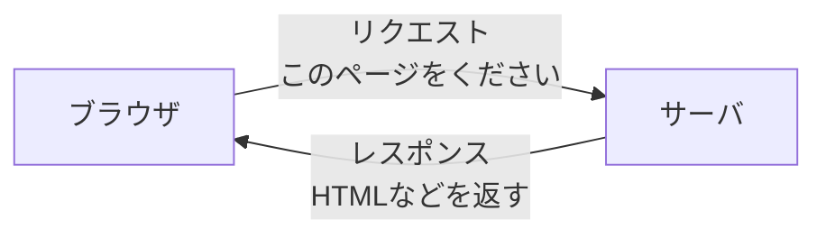
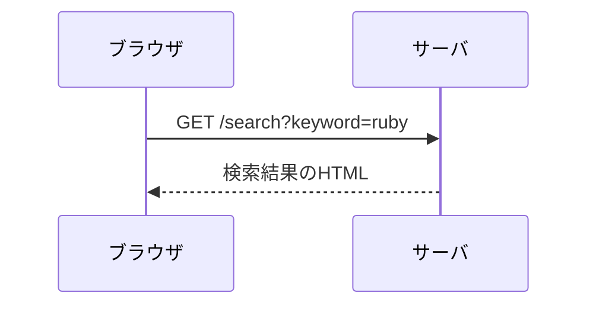
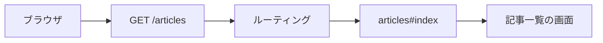
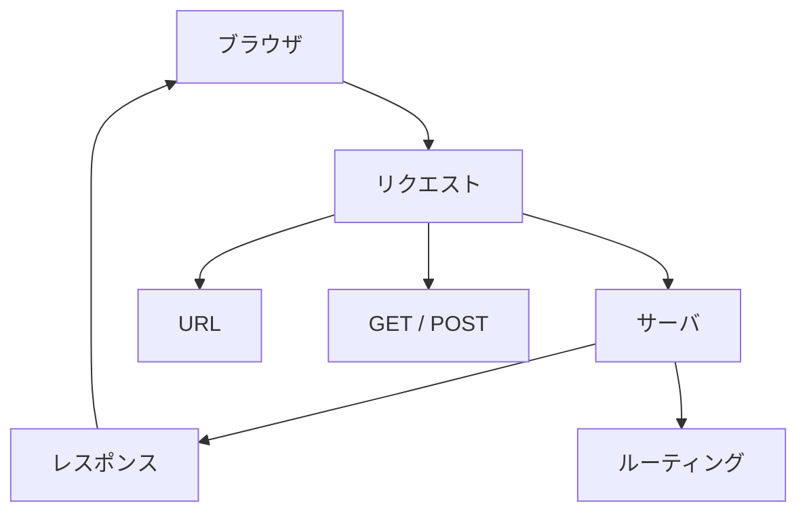

# 第10回：Webの仕組み ── ブラウザとサーバの会話

## 今日のゴール

Webアプリケーションが、ブラウザとサーバのやり取りで動いていることを理解する。

特に、次の言葉を説明できるようになることを目指します。

- ブラウザ
- サーバ
- <ruby>リクエスト<rt>お願い</rt></ruby>
- <ruby>レスポンス<rt>返事</rt></ruby>
- URL
- GET / POST
- ルーティング

---

## 前回までのおさらい

前回までは、Rubyの基本を復習しました。

これまでに、次のようなことを学びました。

- 変数でデータに名前をつける
- 配列で複数のデータをまとめる
- ハッシュで名前つきのデータを扱う
- メソッドで処理をまとめる
- クラスでデータと処理をまとめる

たとえば、次のようなコードです。

```ruby
class Article
  def initialize(title, body)
    @title = title
    @body = body
  end

  def show
    puts @title
    puts @body
  end
end

article = Article.new("はじめての記事", "Rubyを学んでいます")
article.show
```

Rubyでは、データを作り、処理を書き、画面に表示する練習をしてきました。

今回からは、その考え方をWebアプリケーションにつなげていきます。

---

## Webアプリケーションとは

Webアプリケーションは、ブラウザで使うアプリケーションです。

たとえば、次のようなものがあります。

- 検索サイト
- 通販サイト
- SNS
- ブログ
- 学校の出欠管理システム
- 予約システム

これらは、ブラウザで画面を開いて使います。

ただし、ブラウザだけで全部が動いているわけではありません。

多くのWebアプリケーションでは、ブラウザの向こう側にサーバがあります。

---

## ブラウザとサーバ

<ruby>ブラウザ<rt>Webページを見るソフト</rt></ruby> は、Webページを見るためのソフトです。

代表的なブラウザには、次のようなものがあります。

- Google Chrome
- Microsoft Edge
- Safari
- Firefox

<ruby>サーバ<rt>サービスを提供するコンピュータ</rt></ruby> は、ブラウザからのお願いを受け取り、必要な返事を返すコンピュータです。

ブラウザとサーバの関係は、店で注文する流れに似ています。

| Webの言葉 | たとえ |
|---|---|
| ブラウザ | お客さん |
| サーバ | お店 |
| リクエスト | 注文 |
| レスポンス | 商品や返事 |
| URL | お店の住所と注文内容 |

---

## ブラウザとサーバの流れ

ブラウザでWebページを開くと、次のような流れが起きます。



大事なのは、ブラウザが勝手に画面を持っているわけではない、という点です。

ブラウザはサーバにお願いを送ります。

サーバは、そのお願いに対して返事を返します。

この「お願い」と「返事」のやり取りで、Webアプリケーションは動いています。

---

## リクエストとレスポンス

<ruby>リクエスト<rt>request</rt></ruby> は、ブラウザからサーバへ送るお願いです。

たとえば、次のようなお願いです。

- トップページをください
- 記事の一覧をください
- 検索結果をください
- 入力した内容を登録してください

<ruby>レスポンス<rt>response</rt></ruby> は、サーバからブラウザへ返す返事です。

たとえば、次のような返事です。

- HTML
- 画像
- CSS
- JavaScript
- エラー画面

ブラウザは、サーバから受け取ったレスポンスをもとに、画面を表示します。

---

## URLとは

URLは、Web上の場所を表す文字列です。

たとえば、次のようなものです。

```text
https://example.com/articles?keyword=ruby
```

URLは、いくつかの部分に分けて見ることができます。

```text
https://example.com/articles?keyword=ruby
─────  ─────────── ──────── ────────────
通信    サーバの場所   パス       追加の情報
```

| 部分 | 例 | 意味 |
|---|---|---|
| 通信の種類 | `https` | 安全に通信するための方法 |
| サーバの場所 | `example.com` | どのサーバへ送るか |
| パス | `/articles` | サーバ内のどの処理を使うか |
| 追加の情報 | `keyword=ruby` | サーバへ一緒に送る情報 |

URLは、ただの文字列ではありません。

ブラウザがサーバへ送るお願いの宛先と内容を表しています。

---

## GETとは

GETは、サーバから情報を取り出すときによく使うリクエストの種類です。

たとえば、次のような場面で使います。

- ページを見る
- 記事の一覧を見る
- 検索する
- 詳細ページを見る

例です。

```text
GET /articles
```

これは、「記事の一覧をください」というお願いだと考えられます。

検索するときは、URLに情報がつくことがあります。

```text
GET /search?keyword=ruby
```

この場合、`keyword=ruby` という情報を一緒に送っています。

---

## POSTとは

POSTは、サーバへデータを送るときによく使うリクエストの種類です。

たとえば、次のような場面で使います。

- フォームに入力した内容を送る
- 新しい記事を投稿する
- ログイン情報を送る
- お問い合わせ内容を送る

例です。

```text
POST /articles
```

これは、「新しい記事の情報を送ります」というお願いだと考えられます。

---

## GETとPOSTの違い

最初は、次のように考えてください。

| 種類 | よく使う場面 | イメージ |
|---|---|---|
| GET | 情報を見る | ください |
| POST | 情報を送る | 登録してください |

GETは、ページを見るときによく使います。

POSTは、フォームの内容を送るときによく使います。

細かい違いは、Railsを学びながら少しずつ理解していきます。

---

## フォーム送信の観察

Webページには、入力フォームがあります。

たとえば、検索フォームです。

```html
<form action="/search" method="get">
  <input type="text" name="keyword">
  <button type="submit">検索</button>
</form>
```

このフォームには、重要な情報が2つあります。

```html
action="/search"
method="get"
```

`action` は、送信先です。

`method` は、送信方法です。

つまり、このフォームは次のような意味になります。

```text
/search に GET で送る
```

入力欄には、`name="keyword"` と書かれています。

```html
<input type="text" name="keyword">
```

ここに `ruby` と入力して送信すると、次のようなURLになります。

```text
/search?keyword=ruby
```

フォームに入力した値は、サーバへ送られます。

---

## フォーム送信の流れ

検索フォームを送信すると、次のような流れになります。



ブラウザは、入力された内容をリクエストに含めてサーバへ送ります。

サーバは、その内容を受け取り、必要な処理をしてレスポンスを返します。

---

## URLとルーティングの関係

Railsでは、ブラウザから届いたリクエストを、どの処理に渡すかを決めます。

この案内役を <ruby>ルーティング<rt>routing</rt></ruby> といいます。

たとえば、次のようなリクエストが来たとします。

```text
GET /articles
```

Railsでは、これを次のような処理へつなげます。

```text
articles コントローラの index アクション
```

イメージは次の通りです。



ルーティングは、URLと処理をつなぐ案内表です。

---

## Railsで見ると

Railsでは、ルーティングを次のように書くことがあります。

```ruby
get "/articles", to: "articles#index"
post "/articles", to: "articles#create"
```

今は、すべてを覚える必要はありません。

まずは、次のように読めれば十分です。

```text
GET /articles が来たら articles#index へ
POST /articles が来たら articles#create へ
```

次回以降、実際にRailsアプリケーションを作りながら、この流れを確認していきます。

---

## Railsに入る前に押さえること

Railsは、Webアプリケーションを作るための道具です。

ただし、Railsの前に、Webの基本があります。



Railsを学ぶときも、この流れは変わりません。

ブラウザがリクエストを送る。

サーバがレスポンスを返す。

Railsは、そのサーバ側の処理を作るための道具です。

---

## まとめ

今日やったこと：

1. Webアプリケーションは、ブラウザとサーバのやり取りで動くことを知った
2. ブラウザからサーバへ送るお願いをリクエストと呼ぶことを学んだ
3. サーバからブラウザへ返す返事をレスポンスと呼ぶことを学んだ
4. URLは、サーバへの宛先とお願いの内容を表すことを知った
5. GETは情報を見るとき、POSTは情報を送るときによく使うことを知った
6. フォームには送信先と送信方法があることを知った
7. ルーティングは、URLと処理をつなぐ案内表だと知った

> [!IMPORTANT]
> - Webアプリケーションは、ブラウザとサーバの会話で動く
> - リクエストはお願い、レスポンスは返事
> - URLはサーバへの宛先とお願いの内容
> - GETは見る、POSTは送る
> - ルーティングはURLと処理をつなぐ案内表

---

[練習](practice.md) へ進みましょう。
