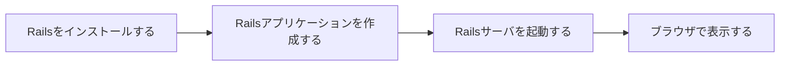
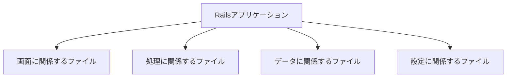
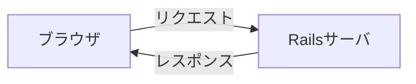
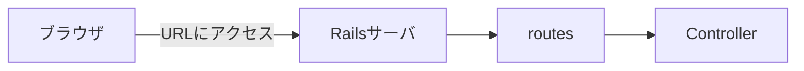
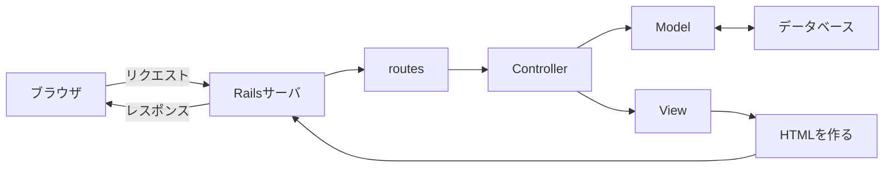

# 第11回：Railsはじめの一歩

## 今日の目標

今回から Ruby on Rails を使います。

今日は、Railsアプリケーションを作成し、ブラウザで表示するところまで進めます。

## 今日使う教材

[Railsチュートリアル](https://railstutorial.jp/) 第1章「ゼロからデプロイまで」を使います。

授業では、Railsアプリケーションの作成と起動を中心に扱います。  
一部の手順は、授業用の環境に合わせて読み替えます。

## 今日やること

- Railsをインストールする
- Railsアプリケーションを作成する
- ターミナルでディレクトリを移動する
- ファイルやディレクトリの一覧を確認する
- Railsサーバを起動する
- ブラウザでRailsアプリケーションを表示する
- Railsの基本的な流れを知る
- MVCという役割分担を知る

## 今日使う主なコマンド

| コマンド | 意味 |
|---|---|
| `gem install rails` | Railsをインストールする |
| `rails -v` | Railsのバージョンを確認する |
| `rails new アプリ名` | Railsアプリケーションを作成する |
| `cd ディレクトリ名` | ディレクトリを移動する |
| `ls` | ファイルやディレクトリの一覧を見る |
| `rails server` | Railsサーバを起動する |
| `rails routes` | URLと処理の対応を確認する |

特に `cd` と `ls` は、今後もよく使います。

## Railsとは

Railsは、RubyでWebアプリケーションを作るためのフレームワークです。

Webアプリケーションとは、ブラウザから操作するアプリケーションのことです。

例：

- 投稿サイト
- 予約システム
- TODOアプリ
- 商品管理システム

Railsを使うと、Webアプリケーションに必要な土台を作りやすくなります。

## Railsアプリケーションを作成する

Railsアプリケーションを作成すると、多くのファイルやディレクトリが作られます。

最初に押さえることは、次の3つです。

- Railsアプリケーションは、たくさんのファイルでできている
- ファイルは役割ごとに分かれている
- 画面、処理、データ、設定などのファイルがある

まずは、Railsアプリケーションには多くのファイルがあり、それぞれに役割があることを覚えます。

## ブラウザとRailsサーバ

第10回では、ブラウザとサーバの関係を学びました。

Railsアプリケーションでも、基本は同じです。

ブラウザがリクエストを送り、Railsサーバがレスポンスを返します。

Railsアプリケーションは、Railsサーバを起動するとブラウザからアクセスできるようになります。

ここで押さえることは、次の2つです。

- Railsサーバを起動すると、ブラウザでRailsアプリケーションを表示できる
- ブラウザとRailsサーバは、リクエストとレスポンスでやり取りする

## URLとroutes

ブラウザでWebアプリケーションを使うときは、URLにアクセスします。

Railsでは、URLと処理の対応を `routes` で管理します。

`rails routes` を実行すると、URLとRailsの処理の対応を確認できます。

ここで押さえることは、次の3つです。

- URLにアクセスすると、Rails側の処理につながる
- URLと処理の対応を管理するものが `routes`
- `rails routes` で対応表を確認できる

## MVCとは

Railsでは、アプリケーションを役割ごとに分けて作ります。

その代表的な考え方が MVC です。

| 名前 | 読み方 | 役割 |
|---|---|---|
| Model | モデル | データに関係する部分 |
| View | ビュー | 画面に関係する部分 |
| Controller | コントローラ | 処理の流れを決める部分 |

今日覚えることは、次の3つです。

- Model はデータ
- View は画面
- Controller は処理の流れ

Railsでは、ブラウザからのリクエストがRailsサーバに届きます。  
`routes` は、URLに対応するControllerの処理を選びます。

Controllerは、必要に応じてModelを使います。  
Modelは、データベースとやり取りします。

Controllerは、Viewを使ってHTMLを作ります。  
Railsサーバは、そのHTMLをレスポンスとしてブラウザに返します。

ここでは、次の4つを覚えます。

- `routes`：URLと処理の対応
- Controller：処理の流れを決める
- Model：データを扱う
- View：画面を作る

まずは、ブラウザからリクエストが送られ、Railsの中で役割分担され、レスポンスが返る流れを押さえます。

## Git・テスト・デプロイについて

Railsチュートリアル第1章には、<ruby>Git<rt>ギット</rt></ruby>、テスト、デプロイも出てきます。

この授業では、今回は作業としては扱いません。

| 用語 | 意味 |
|---|---|
| <ruby>Git<rt>ギット</rt></ruby> | 変更履歴を管理する道具 |
| テスト | プログラムが期待通りに動くか確認する仕組み |
| デプロイ | Webアプリケーションを外部から使えるようにすること |

今回は、Railsアプリケーションを作成し、ブラウザで表示するところまでを目標にします。

## まとめ

今日は、Railsアプリケーションを作成して動かします。

最初に覚える流れは、次の4つです。

Railsでは、ブラウザからのリクエストがRailsサーバに届きます。  
Railsサーバの中では、`routes`、Controller、Model、Viewなどが役割を分担して動きます。

まずは、Railsアプリケーションを作成し、ブラウザで表示するところまで進めましょう。