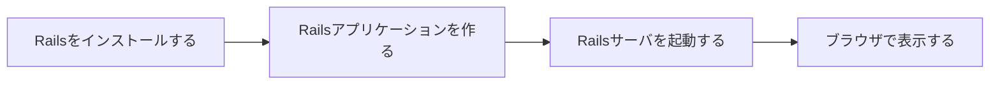
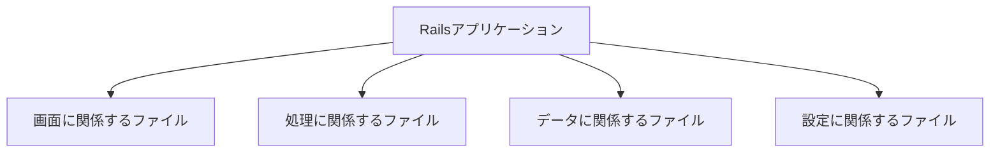
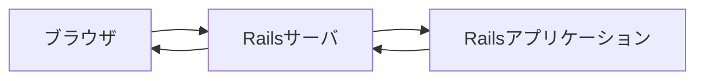
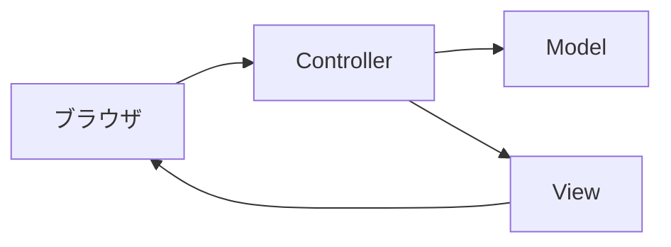
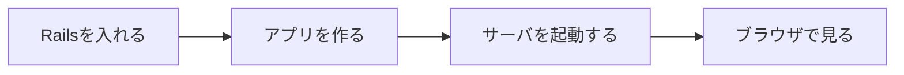

# 第11回：Railsはじめの一歩

## 今日の目標

今回から Ruby on Rails を使います。

今日は、Railsアプリケーションを作成し、ブラウザで表示するところまで進めます。

## 今日使う教材

[Railsチュートリアル](https://railstutorial.jp/) 第1章「ゼロからデプロイまで」を使います。

授業では、Railsアプリケーションの作成と起動を中心に扱います。  
一部の手順は、授業用の環境に合わせて読み替えます。

## 今日やること

- Railsをインストールする
- Railsアプリケーションを作成する
- ターミナルでディレクトリを移動する
- ファイルやディレクトリの一覧を確認する
- Railsサーバを起動する
- ブラウザでRailsアプリケーションを表示する
- MVCという言葉を知る

## 今日使う主なコマンド

| コマンド | 意味 |
|---|---|
| `gem install rails` | Railsをインストールする |
| `rails -v` | Railsのバージョンを確認する |
| `rails new アプリ名` | Railsアプリケーションを作成する |
| `cd ディレクトリ名` | ディレクトリを移動する |
| `ls` | ファイルやディレクトリの一覧を見る |
| `rails server` | Railsサーバを起動する |
| `rails routes` | URLと処理の対応を確認する |

特に `cd` と `ls` は、今後もよく使います。

## Railsとは

Railsは、RubyでWebアプリケーションを作るためのフレームワークです。

Webアプリケーションとは、ブラウザから操作するアプリケーションのことです。

例：

- 投稿サイト
- 予約システム
- TODOアプリ
- 商品管理システム

Railsを使うと、Webアプリケーションに必要な土台を作りやすくなります。

## Railsアプリケーションを作る

Railsアプリケーションを作成すると、多くのファイルやディレクトリが作られます。

最初に覚えることは、次の3つです。

- Railsアプリケーションは、たくさんのファイルでできている
- ファイルは役割ごとに分かれている
- 今日は、すべてのファイルを覚える必要はない

## Railsサーバを起動する

Railsアプリケーションは、作成しただけではブラウザに表示されません。

Railsサーバを起動すると、ブラウザからアクセスできるようになります。

ここで覚えることは、次の2つです。

- Railsサーバを起動すると、ブラウザでRailsアプリケーションを見られる
- ブラウザとRailsサーバは、リクエストとレスポンスでやり取りする

## MVCとは

Railsでは、アプリケーションを役割ごとに分けて作ります。

その代表的な考え方が MVC です。

| 名前 | 読み方 | 役割 |
|---|---|---|
| Model | モデル | データに関係する部分 |
| View | ビュー | 画面に関係する部分 |
| Controller | コントローラ | 処理の流れを決める部分 |

今日は、次のように覚えてください。

- Model はデータ
- View は画面
- Controller は処理の流れ

後期では、この流れを詳しく追いかけます。

## Git・テスト・デプロイについて

Railsチュートリアル第1章には、Git、テスト、デプロイも出てきます。

この授業では、今回は作業としては扱いません。

| 用語 | 意味 |
|---|---|
| Git | 変更履歴を管理する道具 |
| テスト | プログラムが期待通りに動くか確認する仕組み |
| デプロイ | Webアプリケーションを外部から使えるようにすること |

今回は、Railsアプリケーションを作成し、ブラウザで表示するところまでを目標にします。

## 今日の確認

最後に、次のことを確認します。

- Railsをインストールできた
- Railsアプリケーションを作成できた
- `cd` でディレクトリを移動できた
- `ls` でファイル一覧を確認できた
- Railsサーバを起動できた
- ブラウザでRailsアプリケーションを表示できた
- MVCの3つの名前を言える

## まとめ

今日は、Railsアプリケーションを作って動かします。

最初に覚える流れは、次の4つです。

