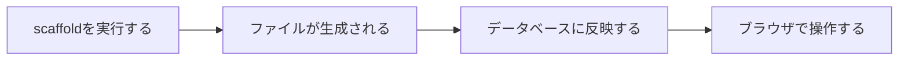
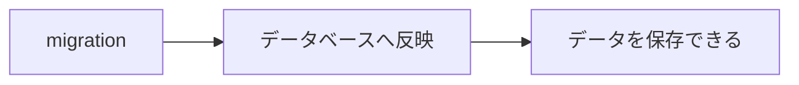
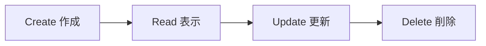
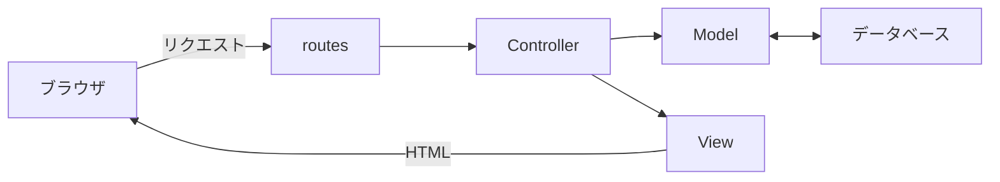
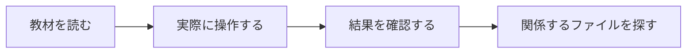

# 第12回：scaffoldでWebアプリケーションを動かそう

[PDF資料](https://drive.google.com/file/d/1cnSRrKRPHZWpc9SjM6AMyLwrDdFCIsVH/view?usp=drive_link)

## 今日の目標

今日は、Railsの`scaffold`を使い、データを登録・表示・編集・削除できるWebアプリケーションを動かします。

今回は、生成されたコードをすべて理解することより、Railsアプリケーションの全体像をつかむことを重視します。

## scaffoldとは

<ruby>scaffold<rt>スキャフォールド</rt></ruby>は「足場」という意味です。

Railsのscaffoldは、データを扱うWebアプリケーションの土台をまとめて生成する機能です。

scaffoldを実行すると、多くのファイルが一度に生成されます。それらのファイルは、役割ごとに分かれています。

| 種類 | 主な役割 |
|---|---|
| Model | データを扱う |
| View | ブラウザに表示するHTMLを作る |
| Controller | リクエストを受け取り、処理の流れを決める |
| routes | URLとControllerの処理を対応させる |
| migration | データベースを変更する手順を記録する |

一度に多くのコードが作られるため、最初からすべてを読んで理解しようとすると混乱しやすくなります。

まずブラウザで操作し、その操作に関係するファイルを少しずつ探していきます。

## migrationとデータベース

scaffoldを実行しただけでは、データを保存する準備は完了していません。

生成されたmigrationをデータベースへ反映する必要があります。

ここでは、次の違いを押さえます。

- scaffold：必要なファイルを生成する
- migration：データベースをどのように変更するか記録する
- migrate：migrationをデータベースへ反映する

具体的なコマンドは、PracticeでRailsチュートリアルを読みながら確認します。

## CRUDとは

データを扱うWebアプリケーションでは、主に4つの操作を行います。

| 英語 | 意味 | 操作の例 |
|---|---|---|
| Create | 作成 | 新しいデータを登録する |
| Read | 取得・表示 | 一覧や詳細を見る |
| Update | 更新 | 登録した内容を変更する |
| Delete | 削除 | データを削除する |

4つの英単語の頭文字を並べたものがCRUDです。

Webアプリケーションの画面を操作するときは、どのCRUDに当たる操作なのかを意識してみましょう。

## URLから画面が表示されるまで

第11回では、RailsのMVCを学びました。

scaffoldで生成されたWebアプリケーションでも、Model、View、Controllerが役割を分担します。

ブラウザでURLへアクセスすると、`routes`が対応するControllerの処理を選びます。

Controllerは、必要に応じてModelからデータを受け取ります。Viewは、そのデータを使ってブラウザに返すHTMLを作ります。

今回は、ブラウザで見ている画面と、生成されたファイルの場所を対応させながら確認します。

## scaffoldは完成品ではない

scaffoldを使うと、短時間で操作できるWebアプリケーションを用意できます。

ただし、生成されるのは開発のための足場です。実際に使うWebアプリケーションにするには、目的に合わせて機能や制限、画面などを追加する必要があります。

scaffoldには、次の特徴があります。

- 短時間でWebアプリケーションの全体像を確認できる
- 同じような機能に必要なファイルをまとめて生成できる
- 一度に多くのコードが作られるため、初学者には理解しにくい部分もある

今日は「動いた」で終わらず、操作したときにどの役割が働いているのかも確認します。

## まとめ

今日は、次の流れで進めます。

まずRailsチュートリアルを読み、書かれている説明と実際の操作を対応させます。

それでは、[練習問題](practice.md)へ進みましょう。
