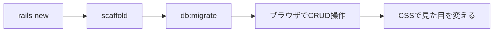
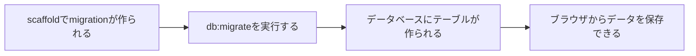
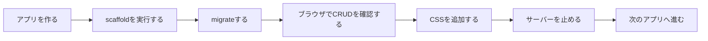

# 第13回：scaffoldで小さなRailsアプリを作ろう

[PDF資料](https://drive.google.com/file/d/19959GdY3elELB-rCL98_J7vqHhVWnCe7/view?usp=drive_link)

## 今日の目標

今日は、Railsの`scaffold`を使って、複数の小さなWebアプリケーションを作ります。



第12回では、Railsチュートリアルを読みながらscaffoldで作られたアプリケーションを動かしました。

今回は、同じ流れを自分の手でくり返します。1つ作り終えたら、サーバーを止めて、次のアプリへ進みます。

## 使うRailsのバージョン

今回は、Rails `8.0.2.1` を使います。

ターミナルで次のコマンドを実行します。

```bash
rails --version
```

次のように表示されれば準備できています。

```text
Rails 8.0.2.1
```

Railsアプリケーションを作るときも、バージョンを指定します。

```bash
rails _8.0.2.1_ new todo_app
```

この書き方にすると、インストールされているRailsの中から `8.0.2.1` を使って新しいアプリケーションを作れます。

## Railsアプリケーションはフォルダ単位で作る

Railsアプリケーションは、1つのフォルダとして作られます。

たとえば、次のコマンドを実行すると、`todo_app` というフォルダが作られます。

```bash
rails _8.0.2.1_ new todo_app
```

その後、作成されたフォルダへ移動します。

```bash
cd todo_app
```

Railsのコマンドは、基本的にアプリケーションのフォルダの中で実行します。

## scaffoldとは

`scaffold`は、データを扱うWebアプリケーションの土台をまとめて作る機能です。

scaffoldを実行すると、CRUDに必要なファイルが生成されます。

| 操作 | 意味 | 画面の例 |
|---|---|---|
| Create | 作成 | 新規登録画面 |
| Read | 表示 | 一覧画面・詳細画面 |
| Update | 更新 | 編集画面 |
| Delete | 削除 | 削除ボタン |

たとえば、タスクを管理する画面を作る場合は、次のように実行します。

```bash
bin/rails generate scaffold Task title:string description:text completed:boolean due_date:date
```

このコマンドには、次の意味があります。

| 部分 | 意味 |
|---|---|
| `Task` | 扱うデータの名前 |
| `title:string` | タイトルを短い文字列として保存する |
| `description:text` | 説明文を長い文章として保存する |
| `completed:boolean` | 完了したかどうかを true / false で保存する |
| `due_date:date` | 日付として保存する |

## migrateでデータベースに反映する

scaffoldを実行しただけでは、まだデータベースにテーブルは作られていません。

生成されたmigrationをデータベースへ反映するため、次のコマンドを実行します。

```bash
bin/rails db:migrate
```



ここでは、次の違いを押さえます。

- `generate scaffold`：ファイルを生成する
- `db:migrate`：データベースに反映する
- ブラウザ操作：データを登録・表示・編集・削除する

## CodespacesでRailsを表示する

CodespacesでRailsサーバーを起動するときは、次のコマンドを使います。

```bash
bin/rails server -b 0.0.0.0
```

`-b 0.0.0.0` は、Codespacesの外側からブラウザでアクセスできるようにするための指定です。

サーバーを起動したら、ポート3000の転送URLを開きます。

## Codespaces用のhost設定

Codespacesの転送URLでRailsアプリケーションを開くため、`config/environments/development.rb` に設定を追加します。

追加する場所は、既存の次のブロックの中です。

```ruby
Rails.application.configure do
  # この中に追加する
end
```

追加するコードは、Practiceで実際に書きます。

この設定は、Codespacesで使うホスト名をRailsに許可するためのものです。Codespacesではない環境では、必要な環境変数がないため何もしません。

## CSSで見た目を変える

scaffoldで作られた画面は、最初はシンプルな見た目です。

CSSは、<ruby>Cascading Style Sheets<rt>カスケーディング・スタイル・シート</rt></ruby>の略です。

HTMLで作られた内容に対して、文字の色や大きさ、余白、配置などの見た目を指定するためのものです。

`Cascading`には、複数の指定が重なったとき、決められた優先順位に従って最終的な見た目が決まるという意味があります。

Railsでも、CSSを追加すると画面の見た目を変えられます。

今回は、追加のgemや外部サービスは使いません。次のファイルにCSSを書きます。

```text
app/assets/stylesheets/application.css
```

CSSを追加した後、ブラウザを再読み込みして、画面の変化を確認します。

## まとめ

今日は、次の流れをくり返します。



scaffoldで生成されたコードをすべて読む必要はありません。

まずは、コマンド、ファイル、ブラウザの画面がどのようにつながっているかを確認します。

それでは、[練習問題](practice.md)へ進みましょう。
