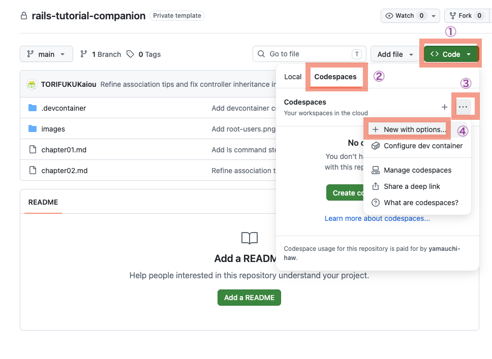
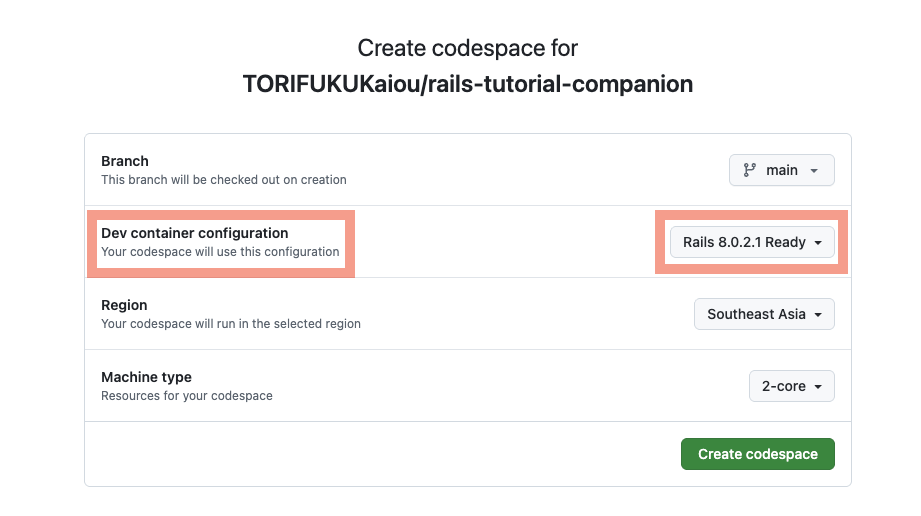

# Practice：scaffoldで3つのRailsアプリを作る

## はじめに

このPracticeでは、Railsの`scaffold`を使って、3つの小さなアプリケーションを作ります。

上から順番に進めてください。

作るアプリケーションは次の3つです。

| アプリケーション | フォルダ名 | 作るもの |
|---|---|---|
| TODOアプリ | `todo_app` | タスクを管理する画面 |
| 読書メモアプリ | `book_app` | 読んだ本を記録する画面 |
| 支出メモアプリ | `expense_app` | 使ったお金を記録する画面 |

---

# Codespaceを起動する

最初に、Railsを動かすためのCodespaceを起動します。

> [!IMPORTANT]
> 今回は、第12回までとはCodespaceの作り方が異なります。
> `Create codespace` をそのままクリックせず、三点リーダー `...` から `New with options...` を選びます。
> その後、Railsが入っている環境を指定してCodespaceを作成します。

## Step 0-1：GitHubのリポジトリを開く

ブラウザで次のリポジトリを開きます。

- [TORIFUKUKaiou/rails-tutorial-companion](https://github.com/TORIFUKUKaiou/rails-tutorial-companion)

GitHubにログインしていない場合は、ログインします。

リポジトリの画面が表示されればOKです。

## Step 0-2：Codespacesの画面を開く

リポジトリ画面の右上付近にある、緑色の `Code` ボタンをクリックします。

表示されたメニューの中で、`Codespaces` タブをクリックします。

## Step 0-3：作成メニューを開く

`Codespaces` タブの中にある三点リーダー `...` をクリックします。

表示されたメニューから、次をクリックします。

```text
New with options...
```



## Step 0-4：Rails用のDev Containerを選ぶ

設定画面が表示されたら、`Dev container configuration` を探します。

`Dev container configuration` で、次を選びます。

```text
Rails 8.0.2.1 Ready
```



> [!IMPORTANT]
> 第12回までと同じ設定のまま作成しないでください。
> 必ず `Rails 8.0.2.1 Ready` を選びます。
> Rubyだけの環境を選ぶと、このPracticeで使うRailsが入っていません。

## Step 0-5：Codespaceを作成する

設定画面で、Codespaceを作成するボタンをクリックします。

ボタン名は、画面によって次のように表示されることがあります。

```text
Create codespace
```

または、

```text
Create codespace on main
```

Codespaceの作成が始まったら、画面が切り替わるまで待ちます。

エディタのような画面が開き、下の方にターミナルが表示されればOKです。

ターミナルが表示されていない場合は、画面上部のメニューから次を選びます。

```text
Terminal → New Terminal
```

## Step 0-6：Railsのバージョンを確認する

ターミナルで次のコマンドを実行します。

```bash
rails --version
```

次のように表示されることを確認します。

```text
Rails 8.0.2.1
```

> [!IMPORTANT]
> このPracticeでは Rails `8.0.2.1` を使います。
> 違うバージョンが表示された場合は、作業を進める前に教員へ確認してください。

Railsのバージョンを確認できたら、TODOアプリの作成へ進みます。

---

# アプリ1：TODOアプリ

TODOアプリでは、タスクを登録・表示・編集・削除します。

## Step 1-1：TODOアプリを作る

ターミナルで次のコマンドを実行します。

```bash
rails _8.0.2.1_ new todo_app
```

コマンドの実行が終わるまで待ちます。

終わると、`todo_app` というフォルダが作られます。

## Step 1-2：TODOアプリのフォルダへ移動する

次のコマンドを実行します。

```bash
cd todo_app
```

今いる場所を確認します。

```bash
pwd
```

表示の最後が、次のようになっていればOKです。

```text
todo_app
```

## Step 1-3：TODOアプリでRailsのバージョンを確認する

次のコマンドを実行します。

```bash
bin/rails --version
```

次のように表示されることを確認します。

```text
Rails 8.0.2.1
```

## Step 1-4：Taskのscaffoldを作る

TODOアプリでは、`Task` という名前のデータを扱います。

次のコマンドを実行します。

```bash
bin/rails generate scaffold Task title:string description:text completed:boolean due_date:date
```

表示の中に、次のような行が含まれていればOKです。

```text
create    app/models/task.rb
create    app/controllers/tasks_controller.rb
create    app/views/tasks
```

このコマンドで、タスクの一覧画面、新規作成画面、編集画面などに必要なファイルが作られます。

## Step 1-5：データベースに反映する

次のコマンドを実行します。

```bash
bin/rails db:migrate
```

次のような表示が出ればOKです。

```text
CreateTasks: migrated
```

これで、タスクを保存するためのテーブルがデータベースに作られました。

## Step 1-6：Codespaces用の設定を追加する

`config/environments/development.rb` を開きます。

ファイルの中から、次の行を探します。

```ruby
Rails.application.configure do
```

その少し下に、次のコードを追加します。

```ruby
pf_domain = ENV["GITHUB_CODESPACES_PORT_FORWARDING_DOMAIN"]
codespace_name = ENV["CODESPACE_NAME"]

if pf_domain.present? && codespace_name.present?
  pf_host = "#{codespace_name}-3000.#{pf_domain}"
  config.hosts << pf_host
end
```

> [!NOTE]
> この設定は、Codespacesで公開したポート3000のURLからRailsアプリを開けるようにするためのものです。

追加後の形は、次のようになります。

```ruby
Rails.application.configure do
  # Settings specified here will take precedence over those in config/application.rb.

  pf_domain = ENV["GITHUB_CODESPACES_PORT_FORWARDING_DOMAIN"]
  codespace_name = ENV["CODESPACE_NAME"]

  if pf_domain.present? && codespace_name.present?
    pf_host = "#{codespace_name}-3000.#{pf_domain}"
    config.hosts << pf_host
  end

  # もともと書かれていた設定は、この下にも続きます
end
```

> [!IMPORTANT]
> `development.rb` のファイル全体を置き換えないでください。
> 今ある内容は消さずに、上のコードだけを追加します。

保存したら次へ進みます。

## Step 1-7：TODOアプリのサーバーを起動する

次のコマンドを実行します。

```bash
bin/rails server -b 0.0.0.0
```

次のような表示が出れば、サーバーが起動しています。

```text
* Listening on http://0.0.0.0:3000
```

このターミナルは、サーバーを動かすために使っています。

サーバーを止めるまでは、このターミナルに次のコマンドを入力しません。

## Step 1-8：TODOアプリをブラウザで開く

Codespacesのポート3000のURLを開きます。

URLの最後に `/tasks` を付けます。

```text
/tasks
```

たとえば、次のようなURLになります。

```text
https://xxxxxxxx-3000.app.github.dev/tasks
```

`Tasks` の画面が表示されればOKです。

## Step 1-9：タスクを1件作る

ブラウザで `New task` をクリックします。

フォームに次のように入力します。

| 項目 | 入力する値 |
|---|---|
| Title | Railsの復習 |
| Description | scaffoldでTODOアプリを作る |
| Completed | チェックしない |
| Due date | 今日以降の日付 |

入力したら、登録ボタンをクリックします。

タスクの詳細画面が表示されればOKです。

## Step 1-10：タスクの一覧を確認する

`Back to tasks` をクリックします。

一覧画面に、作成したタスクが表示されていることを確認します。

`Title` に `Railsの復習` が表示されていればOKです。

## Step 1-11：タスクを編集する

一覧画面または詳細画面から、編集リンクをクリックします。

`Title` を次のように変更します。

```text
Railsの復習を完了する
```

保存します。

変更後のタイトルが表示されればOKです。

## Step 1-12：タスクを削除する

作成したタスクの詳細画面を開きます。

削除ボタンをクリックします。

一覧画面に戻り、作成したタスクが表示されなくなっていればOKです。

## Step 1-13：TODOアプリにCSSを追加する

`app/assets/stylesheets/application.css` を開きます。

ファイルの一番下に、次のCSSを追加します。

```css
body {
  max-width: 960px;
  margin: 40px auto;
  padding: 0 24px;
  background: #f6f7fb;
  color: #1f2937;
  font-family: system-ui, -apple-system, BlinkMacSystemFont, "Segoe UI", sans-serif;
}

h1 {
  margin-bottom: 24px;
  color: #111827;
}

a {
  color: #2563eb;
  font-weight: 600;
  text-decoration: none;
}

a:hover {
  text-decoration: underline;
}

div[id^="task_"],
div[id^="book_"],
div[id^="expense_"] {
  margin: 16px 0;
  padding: 20px 24px;
  border-radius: 12px;
  background: #ffffff;
  box-shadow: 0 12px 30px rgba(15, 23, 42, 0.08);
}

form:not(.button_to) {
  max-width: 640px;
  margin: 24px 0;
  padding: 24px;
  border-radius: 16px;
  background: #ffffff;
  box-shadow: 0 12px 30px rgba(15, 23, 42, 0.08);
}

label {
  display: block;
  margin-bottom: 6px;
  font-weight: 700;
}

input[type="text"],
input[type="number"],
input[type="date"],
textarea {
  width: 100%;
  box-sizing: border-box;
  margin-bottom: 16px;
  padding: 10px 12px;
  border: 1px solid #cbd5e1;
  border-radius: 10px;
  font: inherit;
}

input[type="checkbox"] {
  margin-bottom: 16px;
}

input[type="submit"],
button {
  padding: 10px 18px;
  border: 0;
  border-radius: 999px;
  background: #4f46e5;
  color: #ffffff;
  font-weight: 700;
  cursor: pointer;
}

input[type="submit"]:hover,
button:hover {
  background: #4338ca;
}

p[style*="green"] {
  padding: 12px 16px;
  border-radius: 12px;
  background: #dcfce7;
  color: #166534 !important;
  font-weight: 700;
}
```

保存します。

ブラウザを再読み込みします。

一覧画面、フォーム、ボタンの見た目が変わっていればOKです。

## Step 1-14：TODOアプリのサーバーを止める

サーバーを起動しているターミナルを開きます。

`Ctrl + C` を押します。

```text
Ctrl + C
```

ターミナルにコマンドを入力できる状態に戻ればOKです。

## Step 1-15：1つ上のフォルダへ戻る

次のコマンドを実行します。

```bash
cd ..
```

今いる場所を確認します。

```bash
pwd
```

表示の最後が `todo_app` ではなくなっていればOKです。

---

# アプリ2：読書メモアプリ

読書メモアプリでは、本のタイトル、著者、評価、メモを登録します。

## Step 2-1：読書メモアプリを作る

ターミナルで次のコマンドを実行します。

```bash
rails _8.0.2.1_ new book_app
```

コマンドの実行が終わるまで待ちます。

終わると、`book_app` というフォルダが作られます。

## Step 2-2：読書メモアプリのフォルダへ移動する

次のコマンドを実行します。

```bash
cd book_app
```

今いる場所を確認します。

```bash
pwd
```

表示の最後が、次のようになっていればOKです。

```text
book_app
```

## Step 2-3：読書メモアプリでRailsのバージョンを確認する

次のコマンドを実行します。

```bash
bin/rails --version
```

次のように表示されることを確認します。

```text
Rails 8.0.2.1
```

## Step 2-4：Bookのscaffoldを作る

読書メモアプリでは、`Book` という名前のデータを扱います。

次のコマンドを実行します。

```bash
bin/rails generate scaffold Book title:string author:string rating:integer memo:text
```

表示の中に、次のような行が含まれていればOKです。

```text
create    app/models/book.rb
create    app/controllers/books_controller.rb
create    app/views/books
```

このコマンドで、本の一覧画面、新規作成画面、編集画面などに必要なファイルが作られます。

## Step 2-5：データベースに反映する

次のコマンドを実行します。

```bash
bin/rails db:migrate
```

次のような表示が出ればOKです。

```text
CreateBooks: migrated
```

これで、本を保存するためのテーブルがデータベースに作られました。

## Step 2-6：Codespaces用の設定を追加する

`config/environments/development.rb` を開きます。

ファイルの中から、次の行を探します。

```ruby
Rails.application.configure do
```

その少し下に、次のコードを追加します。

```ruby
pf_domain = ENV["GITHUB_CODESPACES_PORT_FORWARDING_DOMAIN"]
codespace_name = ENV["CODESPACE_NAME"]

if pf_domain.present? && codespace_name.present?
  pf_host = "#{codespace_name}-3000.#{pf_domain}"
  config.hosts << pf_host
end
```

追加後の形は、次のようになります。

```ruby
Rails.application.configure do
  # Settings specified here will take precedence over those in config/application.rb.

  pf_domain = ENV["GITHUB_CODESPACES_PORT_FORWARDING_DOMAIN"]
  codespace_name = ENV["CODESPACE_NAME"]

  if pf_domain.present? && codespace_name.present?
    pf_host = "#{codespace_name}-3000.#{pf_domain}"
    config.hosts << pf_host
  end

  # もともと書かれていた設定は、この下にも続きます
end
```

> [!IMPORTANT]
> `development.rb` のファイル全体を置き換えないでください。
> 今ある内容は消さずに、上のコードだけを追加します。

保存したら次へ進みます。

## Step 2-7：読書メモアプリのサーバーを起動する

次のコマンドを実行します。

```bash
bin/rails server -b 0.0.0.0
```

次のような表示が出れば、サーバーが起動しています。

```text
* Listening on http://0.0.0.0:3000
```

このターミナルは、サーバーを動かすために使っています。

サーバーを止めるまでは、このターミナルに次のコマンドを入力しません。

## Step 2-8：読書メモアプリをブラウザで開く

Codespacesのポート3000のURLを開きます。

URLの最後に `/books` を付けます。

```text
/books
```

たとえば、次のようなURLになります。

```text
https://xxxxxxxx-3000.app.github.dev/books
```

`Books` の画面が表示されればOKです。

## Step 2-9：本を1件作る

ブラウザで `New book` をクリックします。

フォームに次のように入力します。

| 項目 | 入力する値 |
|---|---|
| Title | プログラミング入門 |
| Author | 山田太郎 |
| Rating | 5 |
| Memo | Railsのscaffoldを使って読書メモを作った |

入力したら、登録ボタンをクリックします。

本の詳細画面が表示されればOKです。

## Step 2-10：本の一覧を確認する

`Back to books` をクリックします。

一覧画面に、作成した本が表示されていることを確認します。

`Title` に `プログラミング入門` が表示されていればOKです。

## Step 2-11：本を編集する

一覧画面または詳細画面から、編集リンクをクリックします。

`Rating` を次のように変更します。

```text
4
```

`Memo` を次のように変更します。

```text
Railsのscaffoldで読書メモアプリを作った
```

保存します。

変更後の評価とメモが表示されればOKです。

## Step 2-12：本を削除する

作成した本の詳細画面を開きます。

削除ボタンをクリックします。

一覧画面に戻り、作成した本が表示されなくなっていればOKです。

## Step 2-13：読書メモアプリにCSSを追加する

`app/assets/stylesheets/application.css` を開きます。

ファイルの一番下に、次のCSSを追加します。

```css
body {
  max-width: 960px;
  margin: 40px auto;
  padding: 0 24px;
  background: #f6f7fb;
  color: #1f2937;
  font-family: system-ui, -apple-system, BlinkMacSystemFont, "Segoe UI", sans-serif;
}

h1 {
  margin-bottom: 24px;
  color: #111827;
}

a {
  color: #2563eb;
  font-weight: 600;
  text-decoration: none;
}

a:hover {
  text-decoration: underline;
}

div[id^="task_"],
div[id^="book_"],
div[id^="expense_"] {
  margin: 16px 0;
  padding: 20px 24px;
  border-radius: 12px;
  background: #ffffff;
  box-shadow: 0 12px 30px rgba(15, 23, 42, 0.08);
}

form:not(.button_to) {
  max-width: 640px;
  margin: 24px 0;
  padding: 24px;
  border-radius: 16px;
  background: #ffffff;
  box-shadow: 0 12px 30px rgba(15, 23, 42, 0.08);
}

label {
  display: block;
  margin-bottom: 6px;
  font-weight: 700;
}

input[type="text"],
input[type="number"],
input[type="date"],
textarea {
  width: 100%;
  box-sizing: border-box;
  margin-bottom: 16px;
  padding: 10px 12px;
  border: 1px solid #cbd5e1;
  border-radius: 10px;
  font: inherit;
}

input[type="checkbox"] {
  margin-bottom: 16px;
}

input[type="submit"],
button {
  padding: 10px 18px;
  border: 0;
  border-radius: 999px;
  background: #4f46e5;
  color: #ffffff;
  font-weight: 700;
  cursor: pointer;
}

input[type="submit"]:hover,
button:hover {
  background: #4338ca;
}

p[style*="green"] {
  padding: 12px 16px;
  border-radius: 12px;
  background: #dcfce7;
  color: #166534 !important;
  font-weight: 700;
}
```

保存します。

ブラウザを再読み込みします。

一覧画面、フォーム、ボタンの見た目が変わっていればOKです。

## Step 2-14：読書メモアプリのサーバーを止める

サーバーを起動しているターミナルを開きます。

`Ctrl + C` を押します。

```text
Ctrl + C
```

ターミナルにコマンドを入力できる状態に戻ればOKです。

## Step 2-15：1つ上のフォルダへ戻る

次のコマンドを実行します。

```bash
cd ..
```

今いる場所を確認します。

```bash
pwd
```

表示の最後が `book_app` ではなくなっていればOKです。

---

# アプリ3：支出メモアプリ

支出メモアプリでは、買ったもの、金額、カテゴリ、購入日を登録します。

## Step 3-1：支出メモアプリを作る

ターミナルで次のコマンドを実行します。

```bash
rails _8.0.2.1_ new expense_app
```

コマンドの実行が終わるまで待ちます。

終わると、`expense_app` というフォルダが作られます。

## Step 3-2：支出メモアプリのフォルダへ移動する

次のコマンドを実行します。

```bash
cd expense_app
```

今いる場所を確認します。

```bash
pwd
```

表示の最後が、次のようになっていればOKです。

```text
expense_app
```

## Step 3-3：支出メモアプリでRailsのバージョンを確認する

次のコマンドを実行します。

```bash
bin/rails --version
```

次のように表示されることを確認します。

```text
Rails 8.0.2.1
```

## Step 3-4：Expenseのscaffoldを作る

支出メモアプリでは、`Expense` という名前のデータを扱います。

次のコマンドを実行します。

```bash
bin/rails generate scaffold Expense item:string amount:integer category:string purchased_on:date
```

表示の中に、次のような行が含まれていればOKです。

```text
create    app/models/expense.rb
create    app/controllers/expenses_controller.rb
create    app/views/expenses
```

このコマンドで、支出の一覧画面、新規作成画面、編集画面などに必要なファイルが作られます。

## Step 3-5：データベースに反映する

次のコマンドを実行します。

```bash
bin/rails db:migrate
```

次のような表示が出ればOKです。

```text
CreateExpenses: migrated
```

これで、支出を保存するためのテーブルがデータベースに作られました。

## Step 3-6：Codespaces用の設定を追加する

`config/environments/development.rb` を開きます。

ファイルの中から、次の行を探します。

```ruby
Rails.application.configure do
```

その少し下に、次のコードを追加します。

```ruby
pf_domain = ENV["GITHUB_CODESPACES_PORT_FORWARDING_DOMAIN"]
codespace_name = ENV["CODESPACE_NAME"]

if pf_domain.present? && codespace_name.present?
  pf_host = "#{codespace_name}-3000.#{pf_domain}"
  config.hosts << pf_host
end
```

追加後の形は、次のようになります。

```ruby
Rails.application.configure do
  # Settings specified here will take precedence over those in config/application.rb.

  pf_domain = ENV["GITHUB_CODESPACES_PORT_FORWARDING_DOMAIN"]
  codespace_name = ENV["CODESPACE_NAME"]

  if pf_domain.present? && codespace_name.present?
    pf_host = "#{codespace_name}-3000.#{pf_domain}"
    config.hosts << pf_host
  end

  # もともと書かれていた設定は、この下にも続きます
end
```

> [!IMPORTANT]
> `development.rb` のファイル全体を置き換えないでください。
> 今ある内容は消さずに、上のコードだけを追加します。

保存したら次へ進みます。

## Step 3-7：支出メモアプリのサーバーを起動する

次のコマンドを実行します。

```bash
bin/rails server -b 0.0.0.0
```

次のような表示が出れば、サーバーが起動しています。

```text
* Listening on http://0.0.0.0:3000
```

このターミナルは、サーバーを動かすために使っています。

サーバーを止めるまでは、このターミナルに次のコマンドを入力しません。

## Step 3-8：支出メモアプリをブラウザで開く

Codespacesのポート3000のURLを開きます。

URLの最後に `/expenses` を付けます。

```text
/expenses
```

たとえば、次のようなURLになります。

```text
https://xxxxxxxx-3000.app.github.dev/expenses
```

`Expenses` の画面が表示されればOKです。

## Step 3-9：支出を1件作る

ブラウザで `New expense` をクリックします。

フォームに次のように入力します。

| 項目 | 入力する値 |
|---|---|
| Item | 昼食 |
| Amount | 850 |
| Category | 食費 |
| Purchased on | 今日以降の日付 |

入力したら、登録ボタンをクリックします。

支出の詳細画面が表示されればOKです。

## Step 3-10：支出の一覧を確認する

`Back to expenses` をクリックします。

一覧画面に、作成した支出が表示されていることを確認します。

`Item` に `昼食` が表示されていればOKです。

## Step 3-11：支出を編集する

一覧画面または詳細画面から、編集リンクをクリックします。

`Amount` を次のように変更します。

```text
900
```

`Category` を次のように変更します。

```text
外食
```

保存します。

変更後の金額とカテゴリが表示されればOKです。

## Step 3-12：支出を削除する

作成した支出の詳細画面を開きます。

削除ボタンをクリックします。

一覧画面に戻り、作成した支出が表示されなくなっていればOKです。

## Step 3-13：支出メモアプリにCSSを追加する

`app/assets/stylesheets/application.css` を開きます。

ファイルの一番下に、次のCSSを追加します。

```css
body {
  max-width: 960px;
  margin: 40px auto;
  padding: 0 24px;
  background: #f6f7fb;
  color: #1f2937;
  font-family: system-ui, -apple-system, BlinkMacSystemFont, "Segoe UI", sans-serif;
}

h1 {
  margin-bottom: 24px;
  color: #111827;
}

a {
  color: #2563eb;
  font-weight: 600;
  text-decoration: none;
}

a:hover {
  text-decoration: underline;
}

div[id^="task_"],
div[id^="book_"],
div[id^="expense_"] {
  margin: 16px 0;
  padding: 20px 24px;
  border-radius: 12px;
  background: #ffffff;
  box-shadow: 0 12px 30px rgba(15, 23, 42, 0.08);
}

form:not(.button_to) {
  max-width: 640px;
  margin: 24px 0;
  padding: 24px;
  border-radius: 16px;
  background: #ffffff;
  box-shadow: 0 12px 30px rgba(15, 23, 42, 0.08);
}

label {
  display: block;
  margin-bottom: 6px;
  font-weight: 700;
}

input[type="text"],
input[type="number"],
input[type="date"],
textarea {
  width: 100%;
  box-sizing: border-box;
  margin-bottom: 16px;
  padding: 10px 12px;
  border: 1px solid #cbd5e1;
  border-radius: 10px;
  font: inherit;
}

input[type="checkbox"] {
  margin-bottom: 16px;
}

input[type="submit"],
button {
  padding: 10px 18px;
  border: 0;
  border-radius: 999px;
  background: #4f46e5;
  color: #ffffff;
  font-weight: 700;
  cursor: pointer;
}

input[type="submit"]:hover,
button:hover {
  background: #4338ca;
}

p[style*="green"] {
  padding: 12px 16px;
  border-radius: 12px;
  background: #dcfce7;
  color: #166534 !important;
  font-weight: 700;
}
```

保存します。

ブラウザを再読み込みします。

一覧画面、フォーム、ボタンの見た目が変わっていればOKです。

## Step 3-14：支出メモアプリのサーバーを止める

サーバーを起動しているターミナルを開きます。

`Ctrl + C` を押します。

```text
Ctrl + C
```

ターミナルにコマンドを入力できる状態に戻ればOKです。

---

# ふりかえり

## Step 4-1：3つのアプリで同じだったところを確認する

このStepでは、ファイルを変更しません。

3つのアプリで、同じだったところを確認します。

| 同じだったところ | 内容 |
|---|---|
| アプリ作成 | `rails _8.0.2.1_ new アプリ名` を実行した |
| scaffold | `bin/rails generate scaffold ...` を実行した |
| データベース反映 | `bin/rails db:migrate` を実行した |
| サーバー起動 | `bin/rails server -b 0.0.0.0` を実行した |
| ブラウザ確認 | 一覧・詳細・作成・編集・削除を確認した |
| CSS追加 | `app/assets/stylesheets/application.css` にCSSを追加した |

## Step 4-2：3つのアプリで違っていたところを確認する

このStepでは、ファイルを変更しません。

3つのアプリで、違っていたところを確認します。

| アプリ | モデル名 | URL | 主なカラム |
|---|---|---|---|
| TODOアプリ | `Task` | `/tasks` | `title`, `description`, `completed`, `due_date` |
| 読書メモアプリ | `Book` | `/books` | `title`, `author`, `rating`, `memo` |
| 支出メモアプリ | `Expense` | `/expenses` | `item`, `amount`, `category`, `purchased_on` |

同じコマンドの形でも、モデル名やカラム名を変えると、別のアプリケーションになります。

Practiceが終わったら、[Stretch](stretch.md)へ進みましょう。
