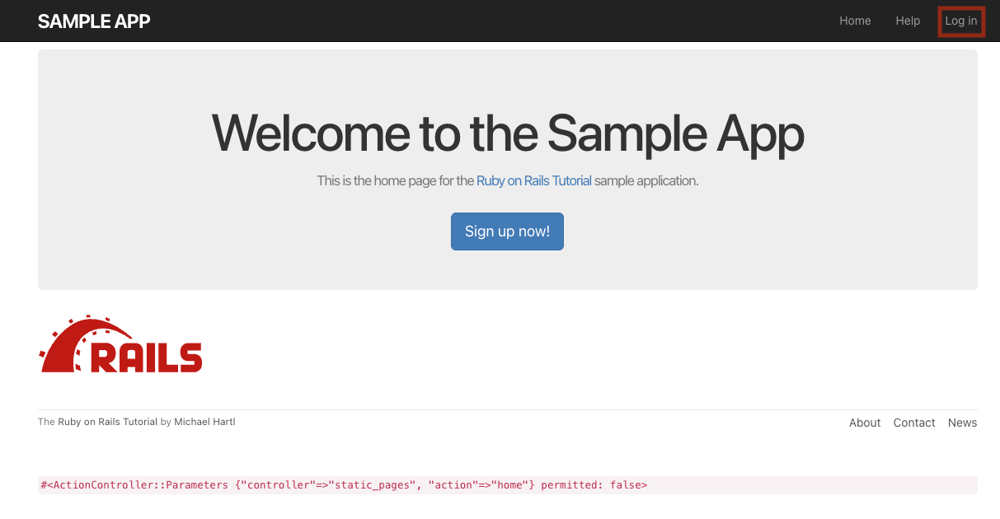

# 第16回：後期オリエンテーション ── scaffoldの復習と完成形アプリの体験

## 今日のゴール

後期の授業へようこそ！今日は次の2つのステップで進めます。

1. **前半（90分）**：前期の復習として、`rails new` と `scaffold` でアプリを動かす感覚を思い出す
2. **後半（90分）**：Railsチュートリアルで最終的に完成する「Twitter（X）クローンアプリ」を動かして、後期の全体像をつかむ

---

## 1. 前半（90分）：scaffoldで感覚を取り戻す

まずは前期の第13回を振り返りながら、手を動かしてCodespacesとRailsの操作感を思い出しましょう。

👉 **[第13回：scaffoldで小さなRailsアプリを作ろう](https://drive.google.com/file/d/19959GdY3elELB-rCL98_J7vqHhVWnCe7/view?usp=drive_link)**

- ターミナルで `rails new` を実行し、Railsアプリを立ち上げる
- `scaffold` で一式生成し、ブラウザで一覧・新規作成・編集・削除を動かす
- [第13回の練習問題](../13/practice.md) に再挑戦！

---

## 2. 後半（90分）：完成形アプリ（第14章）を動かそう！

後期では、単にscaffoldを使うだけでなく、**「ユーザー登録」「ログイン」「つぶやき投稿」「フォロー機能」** といったWebアプリケーションの本格的な仕組みを学んでいきます。

まずは、後期の学習で完成する「X（旧Twitter）クローンアプリ」の完成形を動かして遊んでみましょう！

### Codespace を起動する

以下のボタンをクリックして Codespace を作成してください。（完成形アプリが丸ごと立ち上がります）

[](https://codespaces.new/TORIFUKUKaiou/rails8-ch14-codespace)

### 起動手順

Codespacesのターミナルが開いたら、以下のコマンドを実行します。

```bash
# 1. データベースを準備し、サンプルユーザーを一括投入する
rails db:migrate
rails db:seed

# 2. Railsサーバを起動する
bin/rails server
```

> [!TIP]
> ⏰️ `rails db:seed`は、1分程度かかります。

---

### ブラウザで動かして遊んでみよう！



> [!TIP]
> **ログイン情報**
> - メールアドレス: `example-1@railstutorial.org`
> - パスワード: `password`

- ログイン後、`HOME`リンクを押してください
- 自由につぶやき（マイクロポスト）を投稿してみよう
- 他のユーザー一覧(`Users`リンク)を見て、誰か（アイコンが設定されている投稿があるユーザー）をフォローしてみよう
- フォローしたあと、`HOME`リンクを押して、リロードしてください => フォローしたユーザの投稿がみえましたか？
