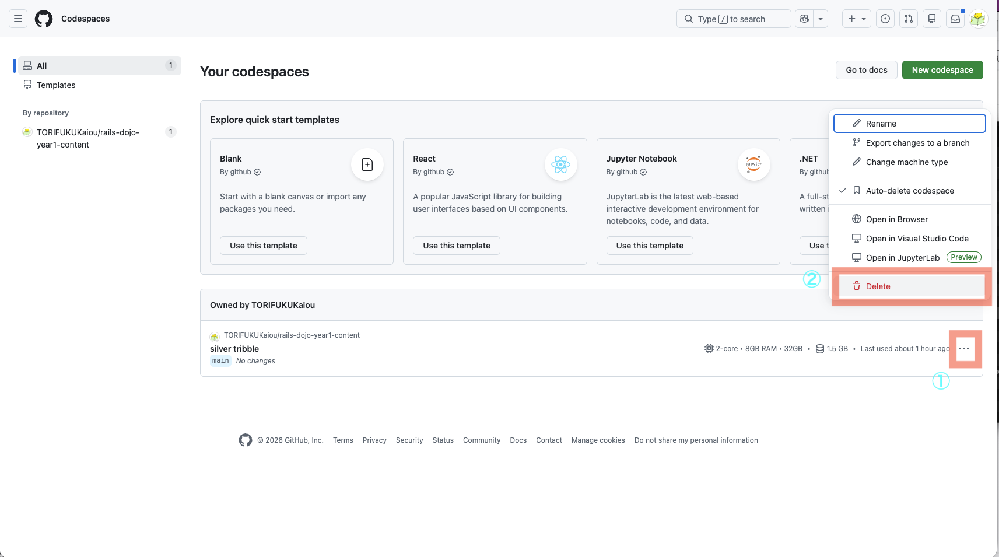

# Codespace を削除する

授業の最後に、使い終わった Codespace は削除します。

使っていない Codespace を残したままにすると、無駄にリソースを使ってしまうからです。毎回消して、次の授業ではまた新しく作り直します。

---

## 手順

1. https://github.com/codespaces にアクセスする
2. 消したい Codespace の右側にある三点リーダー `...` をクリックする
3. `Delete` をクリックする

    

4. 確認画面が出たら、削除（`Delete`）を実行する

---

## 補足

- 授業で使うのは、毎回その時間に作った Codespace だけで大丈夫です
- 消しても、次の授業でまた新しく作れます
